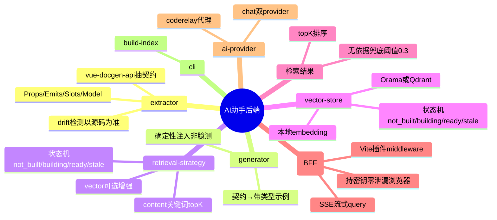
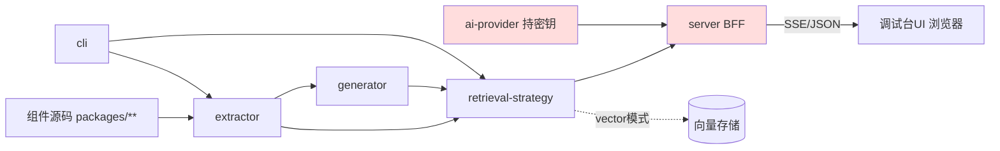
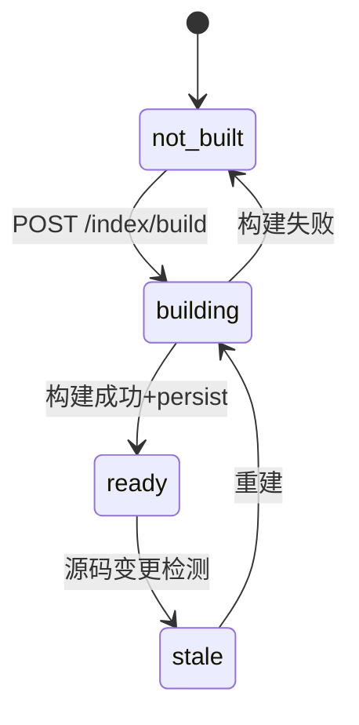
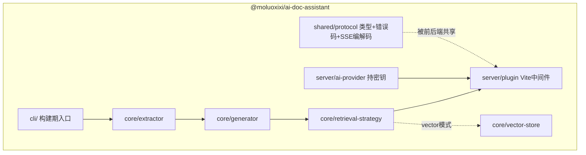

# 组件 AI 文档与调试助手 后端实现任务书

> 状态：实现方案（PLAN 2026-06-13，UPDATED 2026-06-16）。上游门禁已核：PRD 定稿、测试设计定稿、`docs/out-api/` 契约就绪、架构 ACCEPTED（含 ADR-0001~0007）。本任务书为方案级（供评审「后端打算怎么做」），非施工脚本。后端域 = extractor / generator / retrieval-strategy / vector-store / BFF（server）/ ai provider / cli。前端调试台 UI 归 `docs/plan/frontend/`。

## 实现大纲（图在前）

### 后端任务脑图

### 模块分层与依赖方向

依赖严格单向：源码 → extractor → generator/retrieval-strategy → server → UI。ai-provider（持密钥）只被 server 在**服务端**调用，绝不进浏览器（ADR-0002 红线）。vector 模式的 embedding 走本地模型，不需要远端 embedding key。

### 索引状态机

## 需求背景

（摘自 PRD `docs/prds/组件AI文档与调试助手.md`）核心：基于 AST 提取组件真实契约 → 查询时按需用大模型生成带类型提示的答案与示例（路线 B）→ 自然语言问答接本地组件库知识库。后端承担：契约提取、示例生成、知识库构建与检索、BFF 代理大模型（持密钥）、CLI 刷新工具。验收锚点：契约与源码一致、答案附真实来源无幻觉、检索 < 500ms、首字 < 3s、可发 npm。

## 数据模型

> 无默认数据库；"数据模型" = 内存中的公共契约与检索态。vector 模式可选使用 Orama/Qdrant 等向量存储。

| 实体 | 字段 | 类型 | 约束 | 说明 |
|---|---|---|---|---|
| ComponentContract | name | string | 必填唯一 | 组件名（门面导出名） |
| ComponentContract | package | string | 必填 | 所属包 |
| ComponentContract | props | PropDef[] | — | 名/类型/默认值/必填/描述 |
| ComponentContract | emits | EmitDef[] | — | 事件名/payload 类型 |
| ComponentContract | slots | SlotDef[] | — | 插槽名/作用域类型 |
| ComponentContract | model | ModelDef[] | — | v-model 绑定 |
| ComponentContract | sourceFile | string | 必填 | 源码路径（可追溯） |
| IndexDoc | id | string | PK | 组件名或分块 id |
| IndexDoc | text | string | 必填 | 可检索正文（契约序列化） |
| IndexDoc | meta | object | — | component/package/docPath/propsCount |
| IndexMeta | state | enum | 必填 | not_built/building/ready/stale |
| IndexMeta | builtAt | string\|null | — | ISO8601 |
| IndexMeta | sourceHash | string | — | 源码指纹，变更检测用 |

## 接口设计

> 契约详见 `docs/out-api/ai-debug-assistant.md`，此处给后端落地视角（handler/DTO/校验/错误码）。

| 方法 | 路径 | DTO | 校验 | 错误码 |
|---|---|---|---|---|
| POST | /__ai-doc/api/query | QueryReq{question,topK?} | question 非空 | 400 INVALID_REQUEST / 409 INDEX_NOT_READY / 502 UPSTREAM_ERROR |
| GET | /__ai-doc/api/index/status | — | — | 500 INTERNAL_ERROR |
| POST | /__ai-doc/api/index/build | BuildReq{force?} | — | 409 INDEX_NOT_READY(构建中) / 502 UPSTREAM_ERROR |
| GET | /__ai-doc/api/components | — | — | 409 INDEX_NOT_READY |
| GET | /__ai-doc/api/health | — | — | — |

query 响应为 SSE：handler 先经 retrieval strategy 检索发 `sources`，再流式转发大模型增量发 `token`，末尾抽取代码块发 `example`，收尾 `done`；上游异常发流内 `error` 并关闭。

## 代码分层与职责

| 模块 | 职责 | 关键依赖 | 不做 |
|---|---|---|---|
| core/extractor | 用 vue-docgen-api 解析 packages/** 出 ComponentContract；与 out-components drift 检测以源码为准 | vue-docgen-api | 不发网络、不碰密钥 |
| core/generator | 契约 → 可检索正文 + 带类型提示示例骨架（确定性，类型来自契约非大模型） | — | 不调大模型 |
| core/retrieval-strategy | 默认 content 结构化关键词 topK；vector 可选增强；统一 build/retrieve 接口与无依据阈值判定 | 本地契约文本；vector 模式动态依赖 vector-store | 不调大模型 |
| core/vector-store | vector 模式下封装 Orama/Qdrant 等向量存储，本地 embedding 后召回 topK | @orama/orama / Qdrant REST（按配置） | 不进入默认 content bundle |
| server/ai-provider | 封装双 chat provider，密钥从 env 注入，经 coderelay 代理 | env 配置项名引用 | 绝不把密钥返回响应 |
| server/plugin | Vite 插件，注册 middleware，路由到 handler，SSE 编码，错误码映射 | vite | 不在客户端 bundle 引入密钥代码 |
| shared/protocol | 请求/响应/SSE 事件类型、错误码常量、SSE 编解码（前后端共享） | — | 无副作用 |
| cli | build-index 命令 | extractor, retrieval-strategy | — |

## 事务与一致性

- **构建原子性**：build 经状态机单飞，成功后替换当前 retrieval strategy；失败回退 not_built/保留旧 ready。
- **状态并发**：building 期间再次 build 返回 409，单飞锁（in-flight Promise）防并发重建。
- **契约-知识库一致性**：IndexMeta.sourceHash = packages/** 契约指纹；启动比对不一致标 stale 并在 status 暴露，不静默用过期知识库。
- **密钥一致性边界**：密钥仅存活在 server 进程内存（从 env 读），不写日志、不进响应、不进客户端 bundle（构建期断言 server 代码不被 UI import）。

## 测试落地

> 对齐 `docs/test/组件AI文档与调试助手.md` 用例编号。

| 模块 | 覆盖用例 | 方式 |
|---|---|---|
| extractor | TC-EXT-01~04 | 单元，真实 packages 源码，无 mock |
| retrieval-strategy | TC-IDX-01~03, TC-RET-01~03 | 集成，默认 content 覆盖关键词 topK / 无命中；vector 路径用本地 fixture/stub |
| server | TC-API-01~07 | Vite middleware in-process（不引 supertest） |
| ai-provider | TC-API-05/06 | provider stub，TC-API-06 断言响应无密钥串 |
| cli | TC-PKG-01~03 | npm pack 产物断言 |
| 性能 | TC-RET-02(可CI) / TC-E2E-06(TBD手动) | 基准计时 |

覆盖率阈值：≥80%（新增逻辑≥90%），新包 vitest.config 配 coverage.thresholds，纳入根 test:coverage。

## 追溯关系

| 实现项 | 来源 PRD/测试 |
|---|---|
| extractor 契约提取 | PRD 契约提取验收 / TC-EXT-* |
| 无依据兜底(阈值0.3) | PRD 无幻觉验收 / TC-RET-03,TC-API-03 |
| SSE 流式 query | PRD 首字<3s / TC-API-01 |
| 密钥不进浏览器 | 架构 ADR-0002 / TC-API-06 |
| 知识库刷新+密钥不入包 | PRD 发 npm / TC-PKG-01~03 |
| content 检索<500ms | PRD 检索性能 / TC-RET-02 |

## 后续 TODO

| 项 | 范围 | 说明 | 状态 |
|---|---|---|---|
| 继承泛型 props 展开 | `core/extractor` / `core/type-resolver` | 支持 `interface XxxProps extends BaseProps<A,B,C> {}` 的字段展开，并把继承来源的字段类型与 JSDoc 回填到 `PropDef`；目标覆盖 `ElementConfigFormProps` / `AntdConfigFormProps` / `ShadcnConfigFormProps` 这类空接口继承核心契约的场景。 | TODO |
| workspace 类型导入追踪 | `core/type-resolver` / `core/external-type-resolver` | 支持从 `import type { ConfigFormProps } from '@moluoxixi/config-form-core'` 追踪到 workspace 包源码，读取被导入类型定义；缺失或解析失败必须显式 FAIL 或记录可追溯原因，不静默退回 `unknown`。 | TODO |
| 类型导出链追踪 | `core/type-resolver` / `component-discovery` 可复用解析能力 | 支持 `export type * from './types'`、`export type { X } from './props'`、包入口 `exports.source` 等导出链解析，避免只能读取当前目录直接类型文件。 | TODO |
| 泛型参数替换 | `core/type-resolver` | 展开继承类型时替换泛型参数，例如 `TFormProps -> ElementConfigFormFormProps`、`TColProps -> ElementConfigFormColProps`，让知识库显示消费方看到的具体 props 类型。 | TODO |

## 风险与待确认

- `MISSING`：vue-docgen-api 对本仓 ConfigForm 这类复杂运行时组件（含 devtools 插件、动态 schema）的契约提取完整度未实测——实现期首个 task 须先用 1~2 个真实组件验证提取质量，不足则评估 @vue/compiler-sfc 直接 AST 兜底。
- `MISSING`：双 chat provider 的选路策略（按模型能力/成本/可用性）PRD 未定，实现期默认主备 failover。
- `TBD`：检索 < 500ms / 首字 < 3s 实测达标值。
- `MISSING`：源码变更检测的触发时机（CLI 手动刷新 vs Vite watch 自动标 stale）——MVP content 模式插件可自动准备，watch stale 自动化留迭代。
