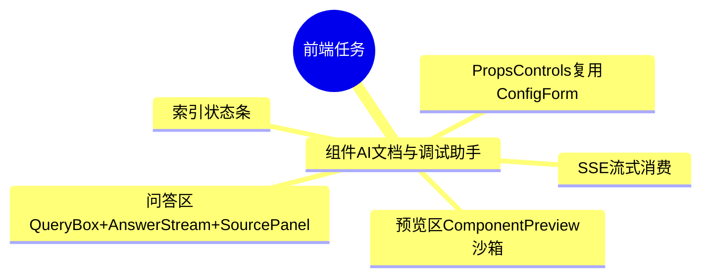

# 前端实现任务书索引

> 前端实现计划（方案级，供评审「前端打算怎么做」）。前置门禁：PRD 定稿 + 测试设计定稿 + out-components/out-api 契约就绪 + 架构 ACCEPTED。

## 任务总览

## task 导航

| 需求模块 | 任务书 | 核心范围 | 状态 |
|---|---|---|---|
| 组件AI文档与调试助手 | [组件AI文档与调试助手](组件AI文档与调试助手.md) | 调试台单页：问答区/预览区/Props控件/SSE消费/沙箱宿主 | 实现方案(PLAN) |

## 说明

- 本索引仅维护前端任务书；后端实现计划见 `docs/plan/backend/index.md`。
- 两个子 skill 不并发写共享 `docs/plan/index.md`，避免相互覆盖。
