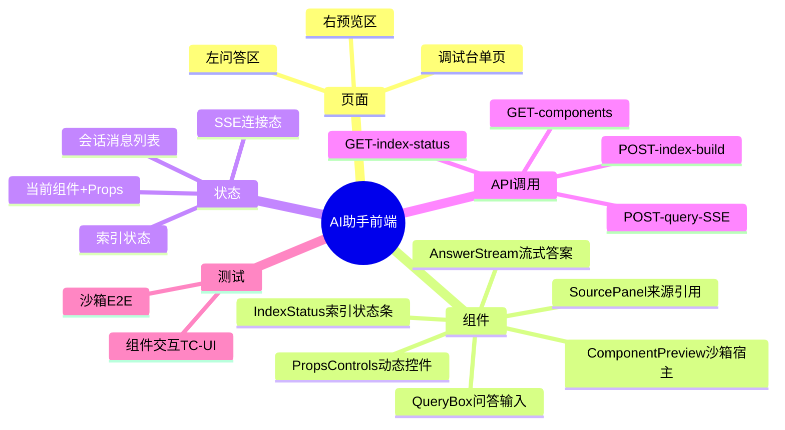
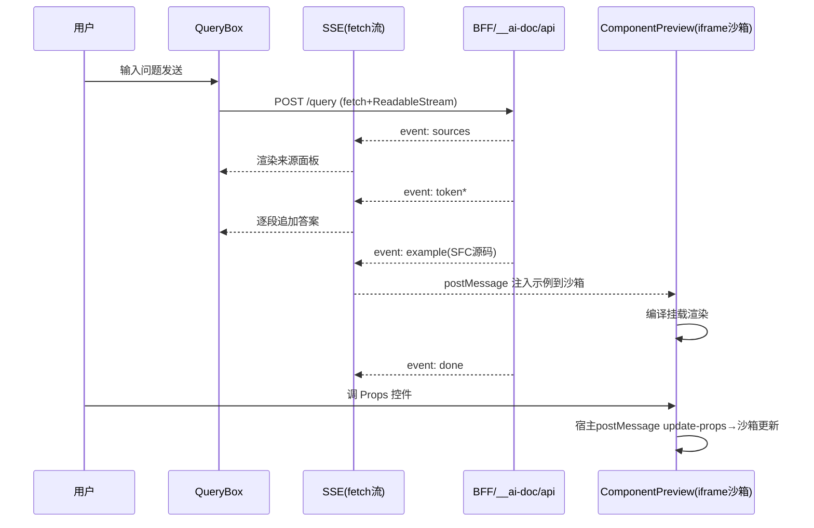
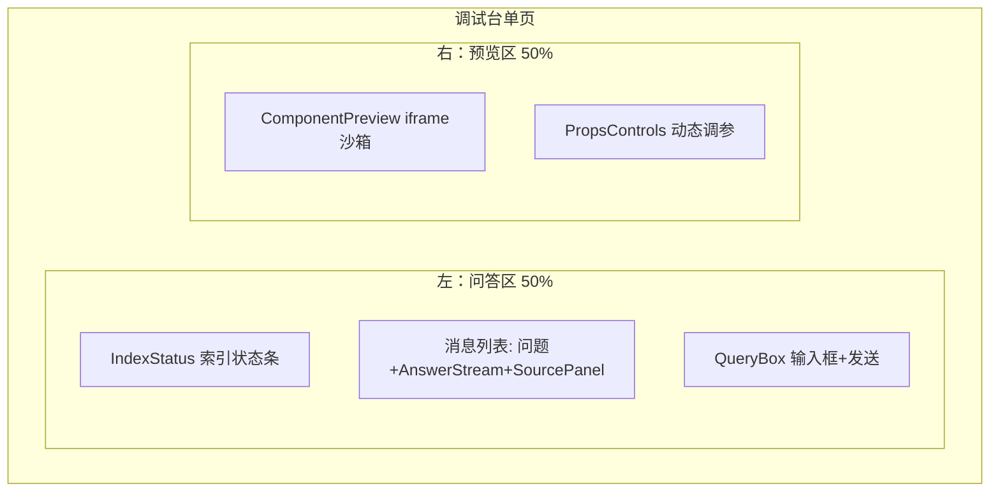
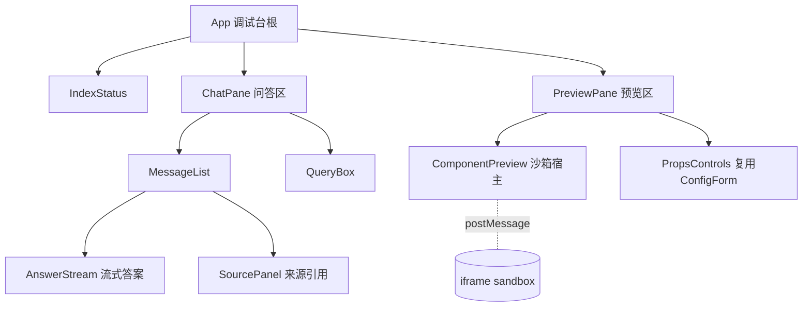

# 组件 AI 文档与调试助手 前端实现任务书

> 状态：实现方案（PLAN 2026-06-13）。上游门禁已核：PRD 定稿、测试设计定稿、`docs/out-components/` 契约就绪、`docs/out-api/` 契约就绪（前端只读消费）。方案级文档，非施工脚本。前端域 = 调试台 UI（问答框 + 流式答案 + 来源面板 + 实时预览/沙箱宿主 + Props 控件）。后端 BFF/检索/索引归 `docs/plan/backend/`。

## 实现大纲（图在前）

### 前端任务脑图



### 调用时序（问答 + 预览）



## 需求背景

（摘自 PRD）交付形态 = 带实时组件预览的 Web 调试台（ChatGPT 式问答 + Storybook 式实时预览结合体）。左侧自然语言问答，右侧把 AI 生成的示例在沙箱内实时渲染、可调 Props 看效果。答案须附真实来源、无依据时显式提示不编造。前端不持密钥，所有模型调用经 BFF。

## 复用组件

| 组件 | 来源 | 用途 |
|---|---|---|
| ConfigForm | docs/out-components/（本项目自有） | Props 动态控件表单（按契约 schema 生成调参 UI），复用其 devtools 能力 |
| 本库基础组件 | docs/out-components/（8 组件） | 作为被预览/调试对象（语料即被试对象） |
| Vue 3.5 内置 | 框架 | Teleport/Transition 等，无需外部 UI 库 |

> MVP 不引入 Element Plus 等外部组件库，调试台自身用轻量原生组件 + ConfigForm，降低发包体积与依赖耦合。若评审要求美化，再评估引入。

## 页面布局



## 组件树



## 状态管理

> MVP 用 Vue `reactive` + composables，不引 Pinia（单页、状态简单）。

| 状态 | 归属 | 说明 |
|---|---|---|
| messages | useChat composable | 会话消息列表（问题/答案/来源/状态） |
| streamState | useChat | idle/streaming/done/error，控制 loading 与禁重复提交 |
| indexStatus | useIndex composable | not_built/building/ready/stale，轮询或事件更新 |
| currentExample | usePreview composable | 当前沙箱内 SFC 源码 |
| propsModel | usePreview | 当前 Props 值，改动经 postMessage 下发沙箱 |
| sandboxReady | usePreview | 沙箱 ready 信号，未 ready 时缓冲下发 |

## API 调用

> 前端只读消费 `docs/out-api/ai-debug-assistant.md` 契约，不设计接口。

| 接口 | 方法 | 入参 | 返回 | 错误处理 |
|---|---|---|---|---|
| /__ai-doc/api/query | POST | {question,topK?} | SSE 流(sources/token/example/done/error) | 用 fetch+ReadableStream 读流；INDEX_NOT_READY→提示先建索引；UPSTREAM_ERROR→提示重试；流内 error 事件→中止并显示 |
| /__ai-doc/api/index/status | GET | — | {state,builtAt,stale} | 启动拉取，驱动 IndexStatus 与 query 可用性 |
| /__ai-doc/api/index/build | POST | {force?} | {state} | 触发后轮询 status 至 ready |
| /__ai-doc/api/components | GET | — | 组件清单 | 供预览选择被试组件 |

> SSE 采用 `fetch` + `ReadableStream` 解析（非 EventSource），因 EventSource 不支持 POST body。

## 测试用例落地

> 对齐 `docs/test/组件AI文档与调试助手.md`。

| 组件/交互 | 覆盖用例 | 方式 |
|---|---|---|
| QueryBox 加载态/禁重复 | TC-UI-01 | 组件测试 @vue/test-utils |
| AnswerStream 增量渲染 | TC-UI-02 | 组件测试，mock SSE 事件序列 |
| SourcePanel 来源渲染 | TC-UI-03 | 组件测试 |
| 空/错误态重试 | TC-UI-04 | 组件测试 |
| PropsControls 实时调参 | TC-UI-05 | 组件测试 |
| ComponentPreview 沙箱全链路 | TC-E2E-01~05 | Playwright 真实浏览器（复用 spike 002 模式） |
| 首字延迟 | TC-E2E-06 | E2E 手动基准(TBD) |

## 追溯关系

| 实现项 | 来源 PRD/测试 |
|---|---|
| 左问答右预览布局 | PRD 交付形态(Web调试台) |
| 流式答案渲染 | PRD 首字<3s / TC-UI-02 |
| 来源面板 | PRD 答案附来源 / TC-UI-03 |
| 沙箱实时预览+调参 | PRD 实时预览 / TC-E2E-01~05 |
| 前端不持密钥 | 架构 ADR-0002 |

## 风险与待确认

- `MISSING`：ConfigForm 能否按 ComponentContract 的 props 类型自动生成调参控件，或需中间适配层（契约 schema → ConfigForm schema）——实现期首个前端 task 验证，不行则退化为按类型映射的简单控件集。
- `MISSING`：多轮会话上下文是否保留（PRD 未明确）——MVP 默认单轮独立问答，多轮留迭代。
- `MISSING`：示例代码块从答案中抽取的约定（markdown ```vue 围栏 vs 结构化 example 事件）——已在 out-api 定为独立 `example` SSE 事件，前端按此消费。
- `TBD`：首字 < 3s 前端感知延迟（含 SSE 解析渲染开销）实测。
