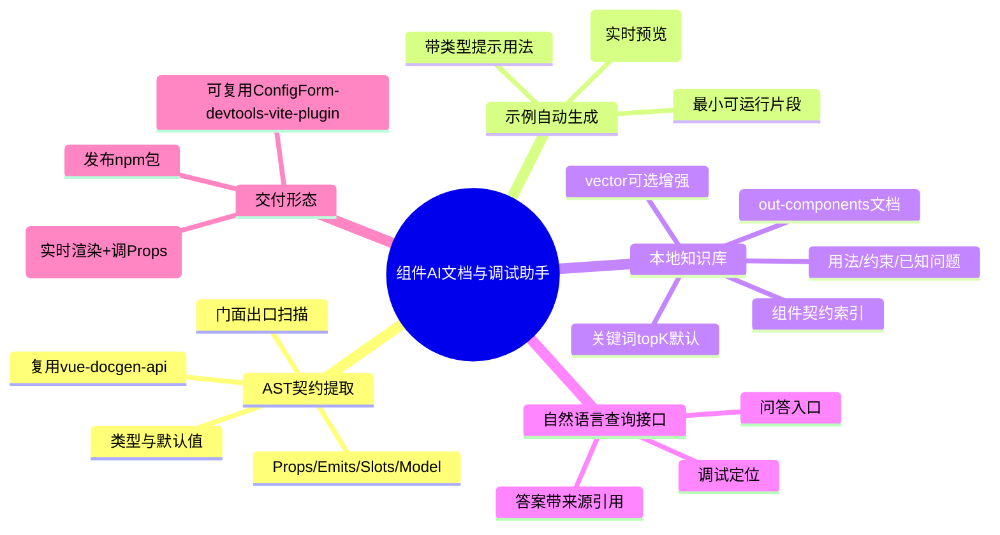
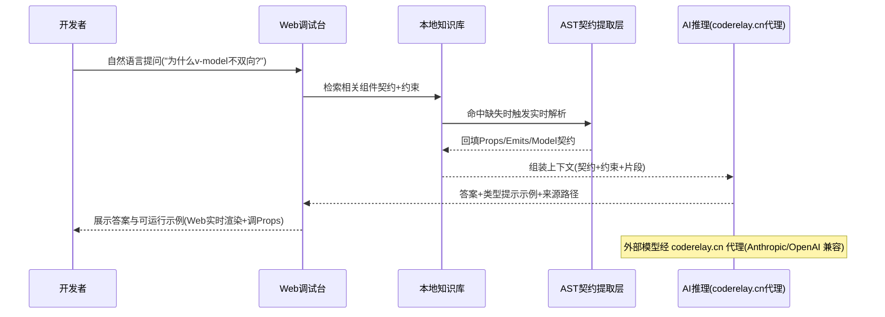

# 组件级 AI 文档与调试助手 需求文档

> 状态：**已定稿（FINALIZED 2026-06-13，UPDATED 2026-06-15）**。所有关键决策已确认，业务 `MISSING` 已清零；仅保留 `MISSING verify script`（环境项，不阻断）。2026-06-15 已按开发者确认把默认检索调整为结构化关键词 topK，向量检索降为可选增强。
>
> 已确认决策（2026-06-13）：
> - 交付形态 = **Web 界面**（带实时组件预览的调试台，非纯静态文档站）。
> - 生成时机 = **路线 B：查询时按需生成**（用户提问 → 检索真实契约 → 大模型现场生成针对性答案与示例；类型提示来自 AST 契约，非大模型幻觉）。
> - 调试能力 = Web 页面支持把生成的示例**实时渲染 + 调 Props + 看效果**。
> - AI 后端 = **外部大模型**，经统一代理端点 `coderelay.cn`：Anthropic 兼容端点（配置项 `AI_ANTHROPIC_BASE_URL` / `AI_ANTHROPIC_API_KEY`）与 OpenAI 兼容端点（`AI_OPENAI_BASE_URL` / `AI_OPENAI_API_KEY`）。密钥存于 gitignored `.env.local`，仅以配置项名引用，禁止明文入库。
> - 知识库检索 = 默认 **content 结构化关键词 topK**（组件名、Props、Emits、Slots、Model、关联类型与字段注释可解释匹配）；`vector` 仅作为可选增强，用于后续确实需要语义召回的场景。
> - 范围 = **先锁本仓 `packages/` 组件**（通用第三方库支持列为后续）。
> - 交付目标 = **对外发布 npm 包**（按发布级标准设计：独立 package、显式 exports、类型声明、changeset 版本管理）。
> - 示例介质 = **`.vue` SFC 片段**（可直接挂载实时预览）。
> - 知识库 = 默认只抽取公共组件契约并在本地内存建立关键词检索态；插件 content 模式首次打开可自动准备，CLI `build-index` 保留为显式刷新/CI 校验入口。vector 模式使用本地 embedding + 可插拔向量存储，默认链路不依赖远端 embedding。
> - 性能目标 = 检索 < 500ms；端到端首字 < 3s（外部模型为主要延迟源）。
> 实际输出位置：`docs/prds/组件AI文档与调试助手.md`（默认边界内），已同步 `docs/prds/index.md` 与 `docs/map.md`。

## 第一部分：评估前置大纲

### 需求脑图

### 核心流程泳道图

### 评估提示（已确认决策见文首）

- 全部关键决策已确认（交付形态、生成时机、AI 后端、检索、范围、npm 发布、示例介质、索引方案、性能目标），详见文首决策块。
- **技术风险点（最高）**：Web 端**动态编译并安全执行**生成的 Vue SFC 代码（运行时 `@vue/compiler-sfc` + 动态挂载），建议进实现前先做 spike 验证可行性与沙箱隔离。
- `MISSING verify script`：本机未定位到 `verify-knowledge-sources.mjs`，知识源注册表未经脚本校验（不阻断需求定稿）。

## 第二部分：正式 PRD（草案）

### 背景

仓库是一个 Vue 组件库 monorepo（`packages/components`、`packages/ConfigForm`、`packages/hooks`），对外提供 8+ 组件契约（见 `docs/out-components/`）。消费方与团队成员理解组件用法时，目前依赖手写文档和翻阅源码；缺少「问一句就能拿到精确、带类型提示、可运行示例」的交互式入口。

Storybook 等现有工具覆盖了「AST 提取契约 + 可视化展示用法」，但缺少自然语言查询与 AI 调试推理能力。本需求的差异化定位在 **NL 查询 + AI 推理 + 本地组件库知识库**，AST 提取层复用成熟库（如 `vue-docgen-api`），不重复造轮子。

### 目标

- 基于 AST 静态分析，自动提取本仓组件的完整契约（Props/Emits/Slots/Model/类型/默认值）。
- 基于契约自动生成带类型提示的最小可运行用法示例。
- 提供自然语言查询接口，结合本地组件库知识库回答用法与调试类问题，答案必须附来源路径。

### 范围

#### 包含

- 本仓 `packages/**` 内组件的契约提取与示例生成。
- 本地知识库的构建（默认结构化关键词 topK；vector 可选增强）与答案组装。
- Web 调试台：自然语言问答 + 生成示例的实时渲染与 Props 调试。

#### 不包含

- 通用支持任意第三方 Vue 组件库（后续迭代）。
- 组件可视化渲染工坊（Storybook 已覆盖，本需求不重复）。

### 用户与角色

| 角色 | 诉求 |
|---|---|
| 组件库维护者 | 快速核对契约、生成示例、回归用法变更 |
| 消费方开发者 | 自然语言提问，拿到精确用法与可运行示例 |
| AI 代理 | 作为知识源，按契约给出无幻觉答案 |

### 业务流程

见第一部分泳道图。核心：提问 → 知识库检索（必要时触发实时 AST 解析回填）→ 组装上下文 → AI 推理 → 返回答案 + 类型提示示例 + 来源。

### 字段口径

| 字段 | 含义 | 来源 | 规则 |
|---|---|---|---|
| 组件契约 | Props/Emits/Slots/Model 及类型/默认值 | `vue-docgen-api` 解析 SFC + 类型目录门面出口 | 以源码 AST 为准；与 `docs/out-components/` 冲突时标 `MISSING component docs drift` |
| 用法示例 | 带类型提示的最小可运行片段 | 由契约生成 | 介质 = `.vue` SFC 片段，可直接挂载实时预览 |
| 来源引用 | 答案依据的文件路径/文档标题 | 知识库索引元数据 | 无来源不得给确定结论（遵循知识源规范） |
| 答案可信度 | 命中知识库 / 推断 / 无依据 | 检索结果 | 无依据时显式标注「无依据」，不得幻觉 |

### 状态与规则

- 知识库索引状态机：`未构建` → `构建中` → `就绪` → `过期(源码变更)`。默认 content 模式由插件自动准备公共契约检索态，也保留手动 CLI 命令用于显式刷新/CI 校验；vector 模式按需构建本地 embedding/向量索引。
- 答案必须可追溯来源；检索不到时返回 `MISSING evidence`，不得编造。

### 验收标准

- 对本仓任一组件，能正确提取其全部公开 Props/Emits/Slots/Model 及类型，与源码一致。
- 生成的示例可在项目类型检查下通过（无类型错误）。
- 自然语言查询返回的答案附带真实来源路径；对知识库无覆盖的问题，明确返回「无依据」而非编造。
- 性能：知识库检索 < 500ms；端到端首字 < 3s。
- 作为 npm 包发布：具备显式 `exports`、`.d.ts` 类型声明、可被消费方安装并运行 CLI 构建索引。

### 风险与待确认

- **技术风险（最高）**：Web 端动态编译并安全执行 AI 生成的 Vue SFC（运行时 `@vue/compiler-sfc` + 动态挂载），是本项目核心难点，建议进实现前先做 spike 验证可行性与沙箱隔离。
- **数据出仓**（已确认接受）：组件源码/契约经 `coderelay.cn` 代理发送至外部模型；按内部组件库处理。密钥仅存 gitignored `.env.local`。
- **npm 发布安全**：发布产物**禁止**打包 `.env.local` / 任何密钥；密钥由消费方自行通过环境变量注入。需在 `package.json` `files` 字段与 `.npmignore` 显式排除。
- `MISSING verify script`：本机未定位到 `verify-knowledge-sources.mjs`，知识源注册表未经脚本校验（不阻断需求定稿）。

### 变更记录

| 日期 | 变更 | 说明 |
|---|---|---|
| 2026-06-13 | 创建草案 | 评估前置大纲 + 正式 PRD 草案，待澄清确认 |
| 2026-06-13 | 确认 6 项决策 | 形态=Web调试台、生成=路线B按需、后端=外部模型(coderelay.cn)、检索=向量+FTS混合、范围=本仓、数据出仓接受 |
| 2026-06-13 | 定稿 | 剩余项拍板：npm 发布、示例=.vue SFC、索引=包内本地文件+text-embedding-3-small、更新=CLI+构建钩子、性能=检索<500ms/首字<3s。业务 MISSING 清零 |
| 2026-06-15 | 调整检索默认值 | 默认改为结构化关键词 topK，vector 仅作为可选增强；插件 content 模式可自动准备知识库，CLI 保留为手动刷新/CI 校验 |
