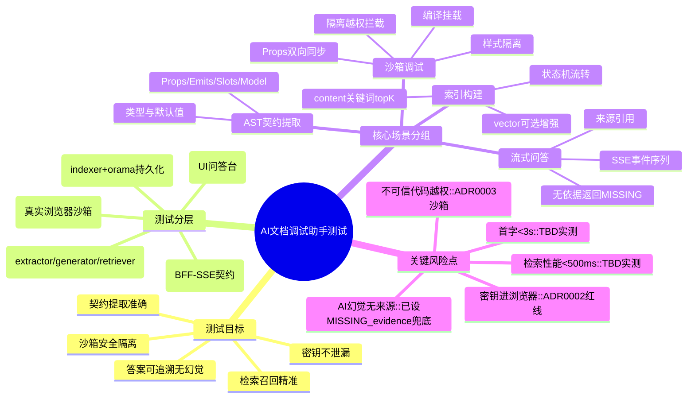

# 组件 AI 文档与调试助手 测试文档

> 状态：**已定稿（ACCEPTED 2026-06-13）**。前置门禁已核：PRD 已定稿、`docs/out-api/`（5 接口契约 planned）、`docs/out-components/`（8 组件契约）就绪。测试策略/分层/Mock/E2E 范围/覆盖率边界（L2）经开发者授权拍板，原 5 项 `MISSING` 已定（见风险与待确认）。`verify-stage-gate.mjs` 本仓未安装（与 PRD `MISSING verify script` 一致，不阻断）。

## 测试脑图

## 测试目标

验证助手满足 PRD 验收标准：(1) 契约提取与源码一致；(2) 生成示例类型检查通过；(3) 答案附真实来源、无覆盖时返「无依据」不编造；(4) 检索 < 500ms、首字 < 3s；(5) 可作 npm 包发布运行；并验证两条架构安全红线（密钥不进浏览器、不可信代码沙箱隔离）。

## 范围

### 包含

- `extractor`（AST 契约提取）、`generator`（示例生成）、`ContentStrategy`（结构化关键词 topK）、`VectorStrategy`（可选向量增强）单元/集成测试。
- BFF 5 接口的契约测试（SSE 事件序列、错误码、零密钥）。
- 调试台 UI 组件测试 + 沙箱 E2E（真实浏览器）。

### 不包含

- 外部大模型本身的回答质量评测（不可控，仅验证「有来源约束 + 无依据兜底」机制）。
- 通用第三方组件库支持（PRD 范围外）。
- npm 发布流程本身的 CI（实现/发布期单独覆盖）。

## 测试分层

| 层级 | 对象 | 工具 | 说明 |
|---|---|---|---|
| 单元 | extractor/generator/retrieval-strategy 纯函数 | Vitest | 契约提取、示例拼装、关键词打分、topK 裁剪与无命中 |
| 集成 | ServerContext + ContentStrategy；VectorStrategy 可选路径 | Vitest | 用真实组件源码构建知识库并查回；vector 路径使用本地 embedding stub/fixture |
| 接口 | BFF `/__ai-doc/api/*` | Vitest + supertest 或 Vite middleware 测试 | SSE 事件序列、错误码、health 不漏密钥；上游 provider stub |
| 组件 | 调试台 UI（问答框/来源面板/Props 控件） | Vitest + @vue/test-utils | 交互、加载/空/错/成功态流转 |
| E2E | 沙箱编译挂载 + 双向同步 + 隔离 | Playwright 真实 Chromium | 复用 spike 001/002 验证模式，真实浏览器断言 |

## 用例矩阵

### AST 契约提取（extractor）

| 编号 | 场景 | 前置条件 | 操作 | 预期 | 层级 | 状态 |
|---|---|---|---|---|---|---|
| TC-EXT-01 | 提取完整 Props | DateRangePicker 源码 | 解析 SFC | Props 名/类型/默认值/必填与源码一致 | 单元 | planned |
| TC-EXT-02 | 提取 Emits/Slots/Model | 含 emit+slot+v-model 组件 | 解析 | Emits/Slots/Model 契约完整 | 单元 | planned |
| TC-EXT-03 | 契约与 out-components 冲突 | 文档与源码不一致 | 解析比对 | 标 `component docs drift`，以源码为准 | 单元 | planned |
| TC-EXT-04 | 门面出口扫描 | package index.ts | 扫描导出 | 仅收录真实导出组件，过滤 utils/types 噪声 | 单元 | planned |

### 索引构建与检索（indexer/retriever）

| 编号 | 场景 | 前置条件 | 操作 | 预期 | 层级 | 状态 |
|---|---|---|---|---|---|---|
| TC-IDX-01 | 构建公共契约知识库 | 8 组件契约 | build-index | content 检索态包含全部公共契约；不触发 embedding | 集成 | planned |
| TC-IDX-02 | 状态机流转 | 索引未构建 | build → 查 status | not_built→building→ready | 集成 | planned |
| TC-IDX-03 | 源码变更标过期 | 已就绪索引 | 改组件源码 | status.stale=true | 集成 | planned |
| TC-RET-01 | 关键词 topK 召回 | 就绪索引 | 查"日期范围选择" | DateRangePicker 排第一且结果数不超过 topK | 集成 | planned |
| TC-RET-02 | 检索性能 | 就绪索引 | 单次检索计时 | < 500ms | 集成 | TBD |
| TC-RET-03 | 无命中 | 查库外问题 | 检索 | 返回空命中，触发无依据兜底 | 集成 | planned |

### BFF 接口契约（SSE / 错误码 / 安全）

| 编号 | 场景 | 前置条件 | 操作 | 预期 | 层级 | 状态 |
|---|---|---|---|---|---|---|
| TC-API-01 | 流式问答事件序列 | 就绪索引 + provider stub | POST /query | SSE 依次 sources→token*→example→done | 接口 | planned |
| TC-API-02 | 答案含真实来源 | 同上 | POST /query | sources 指向真实 out-components 路径 | 接口 | planned |
| TC-API-03 | 无依据不编造 | 库外问题 | POST /query | 返回"无依据"，不输出 example | 接口 | planned |
| TC-API-04 | 索引未就绪 | 未 build | POST /query | 409 INDEX_NOT_READY | 接口 | planned |
| TC-API-05 | 上游失败 | provider stub 抛错 | POST /query | 流内 error 事件 / 502 UPSTREAM_ERROR | 接口 | planned |
| TC-API-06 | health 不漏密钥 | 配置密钥 | GET /health | providers 仅 configured/missing，无密钥串 | 接口 | planned |
| TC-API-07 | 参数校验 | — | POST /query 空 question | 400 INVALID_REQUEST | 接口 | planned |

### 调试台 UI（组件交互）

| 编号 | 场景 | 前置条件 | 操作 | 预期 | 层级 | 状态 |
|---|---|---|---|---|---|---|
| TC-UI-01 | 提问加载态 | 已载入 | 输入问题点发送 | 显示 loading，禁重复提交 | 组件 | planned |
| TC-UI-02 | 流式增量渲染 | mock SSE | 接收 token 流 | 答案逐段追加 | 组件 | planned |
| TC-UI-03 | 来源面板 | mock sources | 收到 sources | 渲染引用列表可点击 | 组件 | planned |
| TC-UI-04 | 空/错误态 | mock error | 接收 error | 显示错误提示，可重试 | 组件 | planned |
| TC-UI-05 | Props 实时调 | 沙箱已挂载 | 改 Props 控件 | 预览组件实时更新 | 组件 | planned |

### 沙箱调试（E2E 真实浏览器）

| 编号 | 场景 | 前置条件 | 操作 | 预期 | 层级 | 状态 |
|---|---|---|---|---|---|---|
| TC-E2E-01 | 沙箱编译挂载 | 调试台运行 | 提交 SFC 示例 | iframe 内渲染成功 | E2E | planned |
| TC-E2E-02 | 越权拦截 | 沙箱含越权代码 | 挂载 | 读/写父 DOM、location 全 SecurityError，宿主未篡改 | E2E | planned |
| TC-E2E-03 | Props 双向同步 | 沙箱已挂载 | 宿主下发 update-props | 沙箱组件接收更新 | E2E | planned |
| TC-E2E-04 | 事件回传 | 沙箱组件 emit | 触发 emit | 宿主收到 event | E2E | planned |
| TC-E2E-05 | 样式隔离 | 沙箱 scoped 样式 | 挂载 | 不污染宿主 | E2E | planned |
| TC-E2E-06 | 首字延迟 | 真实/录制 provider | 提问计时 | 首字 < 3s | E2E | TBD |

### npm 发布产物

| 编号 | 场景 | 前置条件 | 操作 | 预期 | 层级 | 状态 |
|---|---|---|---|---|---|---|
| TC-PKG-01 | 密钥不入包 | 打包 | npm pack 查 tarball | 无 .env.local/密钥文件 | 集成 | planned |
| TC-PKG-02 | 类型声明完整 | 构建 | 检查 .d.ts | 公共 API 有类型导出 | 集成 | planned |
| TC-PKG-03 | 索引产物随包 | 构建 | 查 tarball | persist 索引文件在 files 内 | 集成 | planned |

## 测试数据

- 组件契约语料：复用 `docs/out-components/` 现有 8 个真实组件契约 + `packages/**` 真实源码，不造假组件。
- SFC fixture：复用已迁入正式测试的 `SAMPLE_SFC` / `BROKEN_SFC` / 越权探测 SFC 口径；`spikes/` 可作为本地 gitignored 参考，但不作为正式测试目录、知识库语料或发布输入。
- vector 向量 fixture：仅在覆盖 vector 可选增强路径时使用本地 embedding fixture/stub；默认 content 测试不得触发 embedding。

## Mock 与依赖

- **provider stub**：chat 外部 provider 在单元/集成/接口层全部 stub（固定输入→固定输出），不真实联网。vector 增强路径的 embedding 使用本地 fixture/stub；默认 content 路径不依赖 embedding。原因：外部模型不可控、计费、慢；测试只验证「契约 + 来源约束 + 兜底机制」，不评测模型回答质量。
- **SSE Mock**：UI 组件测试用固定事件序列（sources→token*→example→done / error）驱动，验证渲染逻辑与传输解耦。
- **真实 provider**：仅 E2E 的 TC-E2E-06（首字延迟）可选用真实/录制 provider 实测性能，标 TBD。
- 沙箱 E2E 走真实 Chromium（Playwright），不 mock 浏览器安全模型——隔离断言必须真实。

## 回归范围

- 改动 extractor → 跑 `TC-EXT-*` + TC-IDX-01（契约变更影响索引）。
- 改动检索/索引 → 跑 `TC-IDX-*` + `TC-RET-*` + TC-API-01/02/03。
- 改动 BFF/SSE → 跑 `TC-API-*` + TC-UI-02/03/04。
- 改动沙箱/编译 → 跑全部 `TC-E2E-*`（安全相关，不可跳）。
- 发版前 → 全量 + `TC-PKG-*`。

## 风险与待确认

> 原 5 项 MISSING 已于 2026-06-13 拍板（基于本仓真实 test/test:coverage/test:e2e 脚本与 catalog 管理的 vitest）：

- ✅ **覆盖率阈值（已定）**：沿用 AGENTS 默认——statements/branches/functions/lines ≥ 80%，新增/修改逻辑 ≥ 90% 有意义覆盖。本仓已有 `test:coverage` 脚本（per-package vitest + catalog），新包 `@moluoxixi/ai-doc-assistant` 在自身 `vitest.config` 配 `coverage.thresholds`，纳入根 `pnpm -r ... test:coverage`。
- ✅ **BFF 接口测试方式（已定）**：用 **Vite middleware in-process 测试**（`createServer` 起 Vite + 插件，直接打 middleware），不引 supertest——与 ADR-0005「BFF = Vite 插件」形态一致，且 handler 与传输层解耦本就支持脱离真实端口测试。
- ✅ **无依据兜底阈值（已定）**：检索 top1 归一化 score < `0.3` 视为无命中，触发「无依据」兜底（不输出 example）。阈值设为可配置常量 `NO_MATCH_SCORE_THRESHOLD`，实现期可据真实召回分布微调；TC-RET-03/TC-API-03 断言以此常量为准。
- ✅ **向量 fixture 范围（已调）**：向量 fixture 仅服务 vector 可选增强回归；默认 content 回归以关键词 topK、无命中兜底和上下文裁剪为主，不录制远端 `text-embedding-3-small`。
- ✅ **性能用例执行（已定）**：TC-RET-02（检索 < 500ms）、TC-E2E-06（首字 < 3s）标 `TBD` 不进 CI 门禁（首字依赖外部模型不稳定），作实现期手动基准 + 本地 E2E 可选运行；检索性能可进 CI（不依赖外部网络）。
- 残留 `TBD`：性能数值须实现期真实环境实测确认达标。

