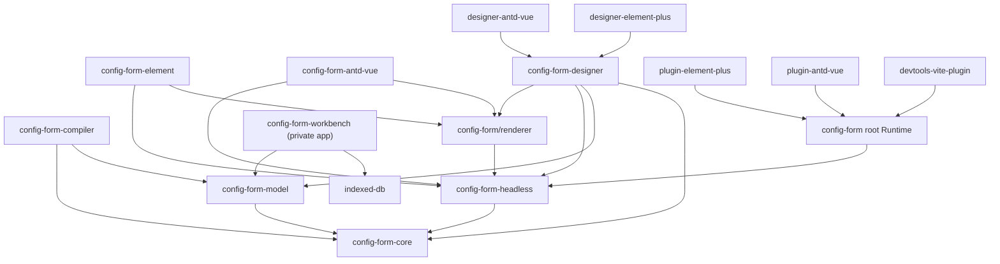

# ConfigForm 架构

本文档是 `packages/ConfigForm` 的架构事实入口，维护包职责、依赖方向、关键协议和扩展边界。子包 README 负责具体 API 与使用示例；当包依赖、公开协议、注册优先级或数据流发生变化时，必须在同一批改动中更新本文档。

## 两条运行路径

ConfigForm 当前保留两条明确分离的路径：

1. **Headless / Renderer 路径**：`@moluoxixi/config-form-headless` 管理字段、校验、状态和 reaction 事务，`@moluoxixi/config-form/renderer` 负责 Vue DOM，Element Plus、Ant Design Vue 和 Designer 都基于这条路径。
2. **Runtime / Plugin 路径**：`@moluoxixi/config-form` 根入口提供旧 Runtime、字段转换和 runtime plugin 生命周期。这条路径不执行 Headless reaction 协议；两条路径的进一步合并需要单独的主版本设计。

`@moluoxixi/config-form/renderer` 是 Runtime 包的子路径导出，不是独立 npm 包。

## 依赖方向

下图中的箭头表示“导入或依赖”：



禁止让 Core 依赖 Vue、Zod、Model、Headless、Runtime、Designer 或 UI 组件库。Model 只依赖 Core 的 JSON/reaction/Flow 协议和纯规则协议，不依赖 Vue、Runtime、Designer、Workbench 或 UI 组件库。

## 包职责

| 层               | 包                                                                                               | 主要职责                                                                                                             |
| ---------------- | ------------------------------------------------------------------------------------------------ | -------------------------------------------------------------------------------------------------------------------- |
| 纯协议           | [`@moluoxixi/config-form-core`](./core/)                                                         | JSON 类型、reaction 条件/effect、Flow IR/Execution Plan/Interpreter、稳定 reducer、配置 helper、通用命名模块注册算法 |
| 项目领域模型     | [`@moluoxixi/config-form-model`](./model/)                                                       | ProjectDocument、规范化 PageGraph、Command/Operation/Transaction、COW 历史、Repository 合同、Schema、legacy 单向迁移 |
| 语义编译器       | [`@moluoxixi/config-form-compiler`](./compiler/)                                                 | RegistryContractSnapshot、CanonicalProjectIR、稳定语义哈希、Flow Execution Plan 与 Runtime/Source backend 共享输入   |
| 表单内核         | [`@moluoxixi/config-form-headless`](./headless/)                                                 | Vue 字段/节点协议、controller、校验、dirty/touched、readonly、runtime slots、reaction 事务、组件注册特化             |
| Vue 渲染         | [`@moluoxixi/config-form/renderer`](./runtime/)                                                  | 原生 form、Grid/Flex、字段壳、ARIA、递归节点/slot 和 readonly 渲染；它是 Runtime 包子路径                            |
| 旧 Runtime       | [`@moluoxixi/config-form`](./runtime/)                                                           | schema 转换、组件解析、字段 pipeline、runtime plugin 和旧 `ConfigForm` 根组件                                        |
| 轻量 UI          | [`config-form-element`](./element/)、[`config-form-antd-vue`](./antd/)                           | 真实 UI 组件、语义别名、值事件绑定和样式                                                                             |
| Runtime plugin   | [`plugin-element-plus`](./plugin-element-plus/)、[`plugin-antd-vue`](./plugin-antd-vue/)         | 旧 Runtime 的默认字段和 readonly adapter；传给 `runtime.plugins`，不是 Vue `app.use()` 插件                          |
| 可视化设计器     | [`config-form-designer`](./designer/)                                                            | 画布、选择/拖拽/overlay、属性面板和 legacy 受控文档兼容边界；正常 Workbench history 属于 ProjectDomainEngine         |
| Designer adapter | [`designer-element-plus`](./designer-element-plus/)、[`designer-antd-vue`](./designer-antd-vue/) | UI 物料、设计器属性控件、readonly、locale、容器预览和 option resolver 生命周期                                       |
| 开发工具         | [`devtools-vite-plugin`](./devtools-vite-plugin/)                                                | 开发态源码定位和调试信息                                                                                             |
| 集成验证         | [`playground`](./playground/)                                                                    | 两套 UI、独立 Designer 页面和端到端交互验证                                                                          |
| 产品工作台       | [`workbench`](./workbench/)                                                                      | 私有在线应用；组合 ProjectEditorSession、Design/Preview、版本化 Repository、模板与只读导出。它不是发布包             |

“轻量 UI 包”“Runtime plugin”“Designer adapter”是三种不同扩展，不应统称为同一种 adapter。

## 关键数据流

### Headless / Renderer

```text
field config
  -> Headless controller / validation / reaction transaction
  -> effective values, state and props
  -> ConfigFormRenderer
  -> registered real Vue component
```

字段显式 `props` 和绑定优先于组件注册项默认值。Element Plus 与 Ant Design Vue 包先提供默认语义组件，再由调用方 `components` 覆盖同名项。

### Designer

```text
Component Registry
  -> ProjectSnapshot / ProjectPage { PageGraph, flows }
  -> ProjectCommand -> OperationBatch -> AppliedTransaction
  -> CompileCoordinator -> PageCompilation
       -> CanonicalPageIR -> Vue Runtime Backend -> Design canvas
       -> iframe RuntimeHost -> adapter resolver -> Preview Runtime
  -> lazy ProjectCompilation
       -> CanonicalProjectIR -> Source Backend -> standalone Vue Source
  -> ProjectDocument -> readonly Config / JSON / Tree
```

现有 `LowCodePageModel` 由 Model 包以 legacy v1 合同拥有，Designer 只保留 deprecated compatibility alias；`DesignerDocument` 仍作为旧 artifact 的兼容投影。Workbench 的规范业务状态是 Model 包的 `ProjectSnapshot/PageGraph`，画布 selection、诊断、option loading 和 reaction projection 都是派生状态。Drag candidate 使用显式 `ProjectDraftSnapshot`，拥有 draftHash 但不拥有正式 editVersion、Repository revision 或 history。

Design Canvas 和右侧 Preview 使用同一份 `PageCompilation` 和同一 Vue Runtime Backend 递归渲染真实注册组件，并分别运行在独立的同源 iframe RuntimeHost。每个 Host 自己加载 adapter resolver、组件库 CSS、Vue Runtime plan 和 Teleport；IDE 只在父 document 渲染 selection、drop、resize 等 editor overlay。Design Host 通过版本化 geometry/pointer bridge 上报稳定 `nodeId`、派生 path、slot 和矩形，业务 Runtime DOM 不包裹编辑器控件。父子 realm 只通过带 channel/version/session/revision/sequence 的 JSON-safe 协议传递 PageCompilation、values、reaction projection、设计态几何/指针信息和稳定 `{ nodeId, event }`，不传 Vue Component、函数、DOM 或 RuntimePlan。结构 sync 与运行 state sync 分离，输入值变化不会重复 clone 或编译页面 IR。拖拽期间 candidate 先应用到临时 Project draft；Canvas candidate 和跟随指针的 drag visual 分别由真实 Design RuntimeHost 渲染同一个稳定 candidate node，drop 后只提交一次 Project Command，因此 candidate、drag visual 与落地结果共享同一 Registry 默认值、slot 和布局规则。

### Workbench Design-first 工作区

```text
Component Registry
  -> ProjectRepository -> immutable ProjectSnapshot
  -> ProjectCommand -> OperationBatch -> ProjectDomainEngine
  -> ProjectEditorSession + ProjectSaveCoordinator
  -> Design canvas (唯一编辑入口)
  -> iframe RuntimeHost -> Runtime Renderer -> right-side Preview
  -> Export menu -> readonly Source / Config preview dialog
```

Workbench 的 Source 与 Config 不再是编辑 provider，也不参与模型反向解析。导出配置使用公开 `defineFields<T>()` / `defineField({...})` API；Source 使用文件树与只读 Monaco 展示不依赖 ConfigForm runtime 的 standalone Vue 工程。JSON / Tree 是配置的辅助查看投影，导出菜单还可下载完整项目 ZIP。旧 `parseDesignerConfig` 与 Designer artifact 解析只用于一次性迁移。

Workbench 以 `ProjectDocument` 作为唯一业务数据；`ProjectSnapshot` 只是其不可变版本 envelope，不得形成第二套结构模型。
ProjectDomainEngine 只管理页面与节点 Command、semantic inverse history 和 change set；
它不依赖 Repository、Vue、当前页或保存状态。ProjectEditorSession 组合领域引擎与
ProjectSaveCoordinator，后者单独拥有 CAS、commit id、saved cursor 和 saving/error 状态。
当前页属于 Workbench/Design navigation session，不进入 ProjectSnapshot 或领域引擎。
页面管理与页面内部编辑不再拥有两套 reducer/revision。Repository 可按 revisioned
Manifest/Page/Resource 实体存储；一个 manifest revision 可以复用较早的未变化 Page/Resource entity revision，但 load/commit 只能发布 checksum 与引用 revision 全部匹配的完整 `PersistedProjectEnvelope`。
`WorkspaceApplication`、`LowCodePageModel` 和 `DesignerDocument` 只用于 legacy ingress 或
现有 Pages/Designer/Export 组件的无状态只读投影，禁止写入旧 Repository、draft 或 history。

打开 Source 导出弹窗时，Workbench 才按需组装当前不可拆分 `ProjectCompilation` 和 generator version
创建一次不可变 `ExportSnapshot`。层级文件树、只读 Monaco、单文件下载和项目 ZIP 全部读取该快照；
后续 Design 修改只会把弹窗标记为 stale，用户显式刷新后才生成新快照。多页面 Source
工程包含 Vue Router、每个页面的独立目录和 `package.json`，且不依赖 ConfigForm
Runtime。Config 导出提供包含每个页面 `defineField` 文件的项目级只读 Source，以及 JSON 和 Tree
投影。快照身份同时比较 compilation key、committed/draft origin 和 generator version；二进制文件
通过防御性字节副本供单文件与 ZIP 下载，调用方不能改写已固定的历史输出。Config Source 在
`extensions['mx.config-form-designer'].placement` 中保留完整父子关系 placement，同时导出 graph
version/props、Project schemaVersion、Registry lock 和 Flow 编辑坐标；numeric `span` 仅作为 Runtime
兼容字段，不取代关系元数据。生成端与 legacy parser 共用危险对象键守卫。

### ProjectDocument 与 Canonical IR 边界

`@moluoxixi/config-form-model` 定义不依赖 Vue 的项目级生产合同：ProjectDocument 保存页面顺序、路由、首页、registry lock、设置和资源引用；ProjectPage 同时拥有视觉 `PageGraph` 与页面级 `flows`，二者随同一个 Page entity 原子持久化。PageGraph 只使用 `root: SlotItem[] + nodesById` 表达视觉结构，节点关系只存在于 layout `slots`，默认子节点统一使用 `slots.default`，placement 属于 SlotItem 表达的父子关系。field/layout 是判别联合，field 节点不能持有 slots。

`@moluoxixi/config-form-compiler` 只依赖 Core/Model 的 JSON-safe 合同。实时 Design/Preview 链路由 `CompileCoordinator` 接收正式 `ProjectSnapshot` 或带基线 identity/draftHash 的瞬态 `ProjectDraftSnapshot`，按 `ProjectChangeSet.pageIds + nodeChanges` 做页面/子树失效并输出不可拆分的 `PageCompilation { snapshotIdentity, registryUsage, key, page }`。页面 key 只包含页面运行语义、实际使用的 Registry contracts、compiler version 和 structural environment；其他页面、Flow 编辑器坐标、未使用物料和 editVersion 不污染该 key。节点顺序只由 `rootIds/slots` 表达，节点 placement 只保留 parent/slot/语义属性，祖先 path 在遍历时派生；subtree hash 使叶节点变化只重建该节点及其语义祖先。Vue Runtime Backend 直接消费 PageCompilation，并按 resolver + 不可变 Canonical node identity 复用真实 Runtime fragment。只有 Source/Config Export 在用户显式打开或刷新导出快照时，才从同一固定 ProjectSnapshot 组装 `ProjectCompilation { snapshot, registry, key, ir }` 与版本化 `CanonicalProjectIR`。两个编译产物共享 Registry defaults、component version/fingerprint、slot order、parent placement 和 Flow execution plan 规则，禁止 backend 回头解释 ProjectDocument 或调用方自行配对不同 revision 的 Snapshot、Registry 和 IR。

Repository/migration boundary 负责把 `unknown` 解析为规范的 `ProjectDocument`。UI 与插件提交 JSON-safe `ProjectCommand`；Command Engine 基于当前快照解析语义 action，生成显式 `ProjectOperation[]`；Transaction Engine 才应用规范 OperationBatch。节点属性删除使用 `node.patch.unset`，禁止借助序列化时会丢失的 `undefined`。Command resolver 允许中间草稿暂态违反跨实体引用，但完整 batch 发布前必须通过最终 Graph/Registry/Flow 校验。`applyProjectTransaction` 使用结构共享的 copy-on-write 草稿，成功后由 History 推进一次 `editVersion`；Repository 只以独立 `expectedRepositoryRevision` 做 CAS。`applyProjectDraftTransaction` 不推进 editVersion、repositoryRevision、timestamp 或 history，candidate 必须再封装为 `ProjectDraftSnapshot`。调用方不得原地修改已发布快照。

旧 `WorkspaceApplication v2`、`LowCodePageModel v1` 和 `DesignerDocument v1` 只允许在 repository ingress 或无状态 compatibility projection 中出现。迁移器会把递归节点树规范化为 PageGraph，并丢弃由模型生成的源码文件；当前 `ProjectDocument v4` 还会在 Repository ingress 确定性读取开发期 v3，将 `graph.flows` 迁移到 `ProjectPage.flows`，双重所有权会直接失败。生成 Source 文件只属于 ExportSnapshot。Workbench Controller 已使用 `ProjectRepository + ProjectEditorSession + ProjectDomainEngine` 作为主路径，禁止新增 legacy Session/Application reducer 或从 Designer 导入持久化模型的代码。

响应式工作区的导航所有权也保持单一：Designer 自带导航时可根据容器焦点切换窄屏
tabpanel；Workbench 传入 `workspace-navigation="external"` 后，移动端底部导航成为窄屏
可见面板的唯一控制者，中屏抽屉状态不得覆盖它。由临时菜单打开 Flow、Page Manager
或 Export 弹窗时，菜单会先把焦点交回稳定触发器，弹窗关闭后再恢复到该触发器。

页面事件流程由当前 `ProjectPage.flows` 唯一持有，视觉 `PageGraph` 不保存流程，`LowCodePageModel.flows` 只作为 legacy 投影：Core 只保存 JSON-safe 的
`page.mount | form.submit | field.change | component.event -> condition/reaction/action -> terminal` DAG，并先编译为确定性的
`ConfigFormFlowExecutionPlan`，Workbench 再注入显式的 `ConfigFormFlowActionRegistry`。
默认工作台只提供无网络副作用的 `notify` action；业务应用应在宿主边界注册自己的
受控 action。Workbench 的页面级 `PageFlowEngine` 独立拥有 action registry、当前 execution plans、Flow projection、调度器、trace/error 边界和跨 page/revision stale generation；Workbench Controller 只把真实 Runtime 事件转成稳定 trigger，并通过 Preview values 读写端口应用 Flow-owned patch。Flow 的运行值、输出、trace、AbortController 和并发状态都是 Preview
瞬态状态，不写回页面结构。ConfigForm Flow 的 trigger、字段引用、排序和 ID 唯一性都以所属页面为边界；切页会清空 projection 并使旧异步结果失效，同页删除 Flow 会裁剪其 projection。未来跨页自动化使用独立 Project Workflow，而不是把同一 Flow 再存到 ProjectDocument root。Source 导出会把流程逻辑展开到 `src/flows.ts`，仍不依赖
ConfigForm DSL。

`component.event` 触发器只保存页面节点的稳定 `nodeId` 与 Registry 声明的 `event` 名称。Designer 物料通过 `events` 显式声明可编排的非 binding 事件，field 的值事件由同一份 Runtime `valueProp/trigger` 自动生成并按事件名去重。Workbench 的正常事件编辑入口只有一个：Inspector 列出当前节点的注册事件，点击后用精确 `{ nodeId, event }` 打开 Flow 弹窗；已有同目标流程时直接选中，否则从该事件源创建。Designer 的逗号 action 字符串编辑器只为兼容宿主保留，不与 Workbench Flow 并存。Semantic Compiler 把当前页面 Flow 实际引用的 `nodeId + event` 投影为 Canonical node `flowEvents`；Vue backend、RuntimeSurface 和 standalone Source 只消费该投影，不扫描 DOM，也不会给未引用的 Registry 事件安装 listener。RuntimeSurface 在 Preview 中从真实 Vue 节点发出事件上下文，Design 模式仍由编辑器桥接拦截；binding listener 先更新 values，再以 Registry 原名分发 Flow，且同一 Vue handler key 只执行一次。简单的 `v-model`、显隐、disabled 和同步 reaction 不应被流程化，只有异步、分支、校验、请求和副作用才进入 Flow。

设计器专属 `id`、`material`、conditions 和 validation 放在 `extensions['mx.config-form-designer']`。业务扩展仍与该命名空间并列保存在 `extensions`，因此 Config、Designer 和 Source 往返时不会把业务元数据藏入设计器私有对象。

## 物料注册器分层

三个 `define*` API 都只是带类型的声明 helper，不执行注册：

| API                                 | 所属层   | 声明内容                                     |
| ----------------------------------- | -------- | -------------------------------------------- |
| `defineConfigFormModule`            | Core     | 通用 `{ name, order?, value }` 命名模块      |
| `defineConfigFormComponentMaterial` | Headless | Vue 组件或 `ConfigFormComponentRegistration` |
| `defineDesignerMaterialModule`      | Designer | `DesignerMaterialDefinition` 与对应 locale   |

真正执行注册的是对应的 `create*Registry`：

```ts
createConfigFormModuleRegistry(modules)
createConfigFormComponentMaterialRegistry(modules)
createDesignerMaterialModuleRegistry(modules)
```

领域 wrapper 保留在 Headless 或 Designer，是为了让 Core 不依赖 Vue 和设计器类型，并允许领域层增加自己的校验。运行时组件物料从 Headless 引入，设计器物料从 Designer 引入。

内置物料采用 `src/materials/<name>.ts`：

- 只有四个 UI 适配器聚合入口使用 eager `import.meta.glob`；Core、Headless 和 Designer 注册算法只接收普通模块映射。
- 文件名、声明 `name` 和 Designer material key 的末段必须一致。
- 注册器拒绝危险名称、重复名称、多点文件名和非法顺序，并按 `order -> name -> source` 确定性排序。
- 扫描只生成内置默认层，不是业务运行时扩展机制。

### 注册优先级

- Element/Antd 轻量 UI：适配器默认组件在前，调用方 `components` 在后，因此调用方覆盖默认项。
- Designer：`createDesignerRegistry` 使用 first-wins；两个 Designer adapter 将调用方 layers 放在默认 layer 前，因此调用方仍然优先。
- 同一个扫描批次内的重复项必须报错，不能依赖对象覆盖或文件系统顺序。

## Reaction 边界

- Core 定义可序列化条件、effect、配置 helper 和纯执行器。
- Headless 将 reaction 接入值事务、字段状态、组件 props 和校验目标。
- Designer 负责文档校验、可视化编辑、引用诊断和隔离的预演模型。
- Runtime 根入口当前不执行 Headless reaction；Renderer 路径执行。

Reaction 派生状态不会修改字段定义、DesignerDocument 或导出 JSON。

## Slot 边界

Headless runtime slots 面向 Vue，允许配置节点、数组、组件和 render function。Designer slots 是可序列化的 `Record<string, DesignerNode[]>`，同时受 material 的 `accepts`、`materials`、`min`、`max` 约束。

需要特定 provider 的结构物料通过 Designer Registry 声明 `allowedParents: [{ material, slot }]`。例如 `element.tab-pane` 只能位于 `element.tabs.default`，`element.collapse-item` 只能位于 `element.collapse.default`。该约束是 Registry 能力，不写入 Config Model；文档分析、Design Runtime 投影、Designer command 和 Model Operation 共用它。非法历史节点会被诊断并从 live projection 中省略，避免在 Vue Runtime 中挂载到缺少 provider 的位置。

空 Flex/Grid 的真实 Runtime 高度可以为 0。设计器只在拖拽进行时用测量后的 overlay hit band 提供可命中区域和虚线提示，不向 slot 注入 trailing sentinel、假节点或永久占位，因此 Preview 与导出仍保持真实 DOM。

二者名字相似但协议不同，不应为了“共用”而抽到 Core。Designer compiler 负责把文档 slot 树编译成 Renderer 可消费的节点树。

## Option source 边界

Designer 维护可序列化的 option source 类型和纯 normalization/cache-key helper。Element Plus 与 Ant Design Vue Designer adapter 各自负责 provider、字典、Vue injection、请求取消、缓存状态和控件渲染。

Core、Headless 和 Designer 核心不主动发起网络请求。异步 option provider 当前也不是 Runtime reaction effect。

## 扩展选择

| 需求                               | 扩展入口                                                |
| ---------------------------------- | ------------------------------------------------------- |
| 为轻量表单注册业务组件             | `components` prop / `ConfigFormComponentRegistry`       |
| 修改旧 Runtime 字段转换或 readonly | `FormRuntimePlugin`                                     |
| 添加业务设计器物料或覆盖内置物料   | 调用方 `DesignerRegistryLayer`，放在默认 layer 之前     |
| 添加内置 UI 物料                   | 对应适配器的 `src/materials/<name>.ts`                  |
| 提供远程或字典选项                 | 对应 Designer adapter 的 option resolver context/plugin |
| 添加非渲染业务元数据               | 节点 `extensions`，使用业务命名空间                     |

## 架构文档维护规则

以下变更必须在同一批代码中更新本文档：

- 新增、删除或重命名 ConfigForm 包或公开子路径；
- 改变包依赖方向、peer dependency 或 UI 框架边界；
- 改变 DesignerDocument、Headless node、reaction、slot 或 option source 协议；
- 改变组件/物料注册方式、命名规则、错误合同或覆盖优先级；
- 改变 Runtime 根入口与 Renderer 路径的职责；
- 新增跨两个以上 ConfigForm 包复用的公共能力。

子包 README 继续维护具体 API。任务设计文档可以记录过程和取舍，但不能替代本文档中的当前架构事实。

## 验证入口

```bash
# ConfigForm 公开包构建、自引用导入和声明消费者
pnpm test:config-form-packages

# 受影响包测试和类型检查
pnpm --filter <package-name> test
pnpm --filter <package-name> typecheck

# Playground 构建
pnpm --filter @config-form/playground build
```
