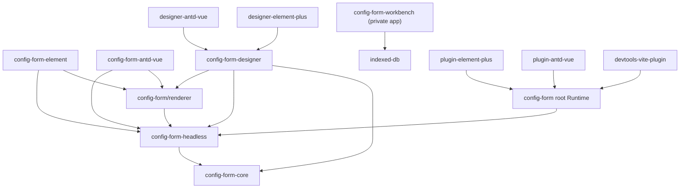

# ConfigForm 架构

本文档是 `packages/ConfigForm` 的架构事实入口，维护包职责、依赖方向、关键协议和扩展边界。子包 README 负责具体 API 与使用示例；当包依赖、公开协议、注册优先级或数据流发生变化时，必须在同一批改动中更新本文档。

## 两条运行路径

ConfigForm 当前保留两条明确分离的路径：

1. **Headless / Renderer 路径**：`@moluoxixi/config-form-headless` 管理字段、校验、状态和 reaction 事务，`@moluoxixi/config-form/renderer` 负责 Vue DOM，Element Plus、Ant Design Vue 和 Designer 都基于这条路径。
2. **Runtime / Plugin 路径**：`@moluoxixi/config-form` 根入口提供旧 Runtime、字段转换和 runtime plugin 生命周期。这条路径不执行 Headless reaction 协议；两条路径的进一步合并需要单独的主版本设计。

`@moluoxixi/config-form/renderer` 是 Runtime 包的子路径导出，不是独立 npm 包。

## 依赖方向

下图中的箭头表示“导入或依赖”：



禁止让 Core 依赖 Vue、Zod、Headless、Runtime、Designer 或 UI 组件库。Headless 和 Designer 可以复用 Core，但 Core 不感知它们的领域类型。

## 包职责

| 层               | 包                                                                                               | 主要职责                                                                                                    |
| ---------------- | ------------------------------------------------------------------------------------------------ | ----------------------------------------------------------------------------------------------------------- |
| 纯协议           | [`@moluoxixi/config-form-core`](./core/)                                                         | JSON 类型、reaction 条件/effect、稳定 reducer、reaction 配置 helper、通用命名模块注册算法                   |
| 表单内核         | [`@moluoxixi/config-form-headless`](./headless/)                                                 | Vue 字段/节点协议、controller、校验、dirty/touched、readonly、runtime slots、reaction 事务、组件注册特化    |
| Vue 渲染         | [`@moluoxixi/config-form/renderer`](./runtime/)                                                  | 原生 form、Grid/Flex、字段壳、ARIA、递归节点/slot 和 readonly 渲染；它是 Runtime 包子路径                   |
| 旧 Runtime       | [`@moluoxixi/config-form`](./runtime/)                                                           | schema 转换、组件解析、字段 pipeline、runtime plugin 和旧 `ConfigForm` 根组件                               |
| 轻量 UI          | [`config-form-element`](./element/)、[`config-form-antd-vue`](./antd/)                           | 真实 UI 组件、语义别名、值事件绑定和样式                                                                    |
| Runtime plugin   | [`plugin-element-plus`](./plugin-element-plus/)、[`plugin-antd-vue`](./plugin-antd-vue/)         | 旧 Runtime 的默认字段和 readonly adapter；传给 `runtime.plugins`，不是 Vue `app.use()` 插件                 |
| 可视化设计器     | [`config-form-designer`](./designer/)                                                            | 受控 JSON 文档、历史、诊断、编译器、画布和属性面板；不直接绑定具体 UI 库                                    |
| Designer adapter | [`designer-element-plus`](./designer-element-plus/)、[`designer-antd-vue`](./designer-antd-vue/) | UI 物料、设计器属性控件、readonly、locale、容器预览和 option resolver 生命周期                              |
| 开发工具         | [`devtools-vite-plugin`](./devtools-vite-plugin/)                                                | 开发态源码定位和调试信息                                                                                    |
| 集成验证         | [`playground`](./playground/)                                                                    | 两套 UI、独立 Designer 页面和端到端交互验证                                                                 |
| 产品工作台       | [`workbench`](./workbench/)                                                                      | 私有在线应用；版本化虚拟项目、本地 repository、模板与源码导出。它不是发布包，也不改变 Runtime/Designer 协议 |

“轻量 UI 包”“Runtime plugin”“Designer adapter”是三种不同扩展，不应统称为同一种 adapter。

## 关键数据流

### Headless / Renderer

```text
field config
  -> Headless controller / validation / reaction transaction
  -> effective values, state and props
  -> ConfigFormRenderer
  -> registered real Vue component
```

字段显式 `props` 和绑定优先于组件注册项默认值。Element Plus 与 Ant Design Vue 包先提供默认语义组件，再由调用方 `components` 覆盖同名项。

### Designer

```text
Component Registry
  -> versioned Config Model
  -> model operations / inverse history
  -> Design canvas + layers + inspector
  -> Runtime renderer / Preview
  -> readonly Config JSON / defineField Source / standalone Vue Source
```

`LowCodePageModel` 是设计器页面结构唯一可变事实。`DesignerDocument` 仍作为旧 artifact 的兼容投影；画布 selection、诊断、option loading 和 reaction projection 都是派生状态，不写回模型。

### Workbench Design-first 工作区

```text
Component Registry
  -> LowCodePageModel
  -> Design canvas (唯一编辑入口)
  -> Runtime Renderer -> right-side Preview
  -> Export menu -> readonly Source / Config preview dialog
```

Workbench 的 Source 与 Config 不再是编辑 provider，也不参与模型反向解析。导出配置使用公开 `defineFields<T>()` / `defineField({...})` API；Source 使用文件树与只读 Monaco 展示不依赖 ConfigForm runtime 的 standalone Vue 工程。JSON / Tree 是配置的辅助查看投影，导出菜单还可下载完整项目 ZIP。旧 `parseDesignerConfig` 与 Designer artifact 解析只用于一次性迁移。

设计器专属 `id`、`material`、conditions 和 validation 放在 `extensions['mx.config-form-designer']`。业务扩展仍与该命名空间并列保存在 `extensions`，因此 Config、Designer 和 Source 往返时不会把业务元数据藏入设计器私有对象。

## 物料注册器分层

三个 `define*` API 都只是带类型的声明 helper，不执行注册：

| API                                 | 所属层   | 声明内容                                     |
| ----------------------------------- | -------- | -------------------------------------------- |
| `defineConfigFormModule`            | Core     | 通用 `{ name, order?, value }` 命名模块      |
| `defineConfigFormComponentMaterial` | Headless | Vue 组件或 `ConfigFormComponentRegistration` |
| `defineDesignerMaterialModule`      | Designer | `DesignerMaterialDefinition` 与对应 locale   |

真正执行注册的是对应的 `create*Registry`：

```ts
createConfigFormModuleRegistry(modules)
createConfigFormComponentMaterialRegistry(modules)
createDesignerMaterialModuleRegistry(modules)
```

领域 wrapper 保留在 Headless 或 Designer，是为了让 Core 不依赖 Vue 和设计器类型，并允许领域层增加自己的校验。运行时组件物料从 Headless 引入，设计器物料从 Designer 引入。

内置物料采用 `src/materials/<name>.ts`：

- 只有四个 UI 适配器聚合入口使用 eager `import.meta.glob`；Core、Headless 和 Designer 注册算法只接收普通模块映射。
- 文件名、声明 `name` 和 Designer material key 的末段必须一致。
- 注册器拒绝危险名称、重复名称、多点文件名和非法顺序，并按 `order -> name -> source` 确定性排序。
- 扫描只生成内置默认层，不是业务运行时扩展机制。

### 注册优先级

- Element/Antd 轻量 UI：适配器默认组件在前，调用方 `components` 在后，因此调用方覆盖默认项。
- Designer：`createDesignerRegistry` 使用 first-wins；两个 Designer adapter 将调用方 layers 放在默认 layer 前，因此调用方仍然优先。
- 同一个扫描批次内的重复项必须报错，不能依赖对象覆盖或文件系统顺序。

## Reaction 边界

- Core 定义可序列化条件、effect、配置 helper 和纯执行器。
- Headless 将 reaction 接入值事务、字段状态、组件 props 和校验目标。
- Designer 负责文档校验、可视化编辑、引用诊断和隔离的预演模型。
- Runtime 根入口当前不执行 Headless reaction；Renderer 路径执行。

Reaction 派生状态不会修改字段定义、DesignerDocument 或导出 JSON。

## Slot 边界

Headless runtime slots 面向 Vue，允许配置节点、数组、组件和 render function。Designer slots 是可序列化的 `Record<string, DesignerNode[]>`，同时受 material 的 `accepts`、`materials`、`min`、`max` 约束。

二者名字相似但协议不同，不应为了“共用”而抽到 Core。Designer compiler 负责把文档 slot 树编译成 Renderer 可消费的节点树。

## Option source 边界

Designer 维护可序列化的 option source 类型和纯 normalization/cache-key helper。Element Plus 与 Ant Design Vue Designer adapter 各自负责 provider、字典、Vue injection、请求取消、缓存状态和控件渲染。

Core、Headless 和 Designer 核心不主动发起网络请求。异步 option provider 当前也不是 Runtime reaction effect。

## 扩展选择

| 需求                               | 扩展入口                                                |
| ---------------------------------- | ------------------------------------------------------- |
| 为轻量表单注册业务组件             | `components` prop / `ConfigFormComponentRegistry`       |
| 修改旧 Runtime 字段转换或 readonly | `FormRuntimePlugin`                                     |
| 添加业务设计器物料或覆盖内置物料   | 调用方 `DesignerRegistryLayer`，放在默认 layer 之前     |
| 添加内置 UI 物料                   | 对应适配器的 `src/materials/<name>.ts`                  |
| 提供远程或字典选项                 | 对应 Designer adapter 的 option resolver context/plugin |
| 添加非渲染业务元数据               | 节点 `extensions`，使用业务命名空间                     |

## 架构文档维护规则

以下变更必须在同一批代码中更新本文档：

- 新增、删除或重命名 ConfigForm 包或公开子路径；
- 改变包依赖方向、peer dependency 或 UI 框架边界；
- 改变 DesignerDocument、Headless node、reaction、slot 或 option source 协议；
- 改变组件/物料注册方式、命名规则、错误合同或覆盖优先级；
- 改变 Runtime 根入口与 Renderer 路径的职责；
- 新增跨两个以上 ConfigForm 包复用的公共能力。

子包 README 继续维护具体 API。任务设计文档可以记录过程和取舍，但不能替代本文档中的当前架构事实。

## 验证入口

```bash
# ConfigForm 公开包构建、自引用导入和声明消费者
pnpm test:config-form-packages

# 受影响包测试和类型检查
pnpm --filter <package-name> test
pnpm --filter <package-name> typecheck

# Playground 构建
pnpm --filter @config-form/playground build
```
