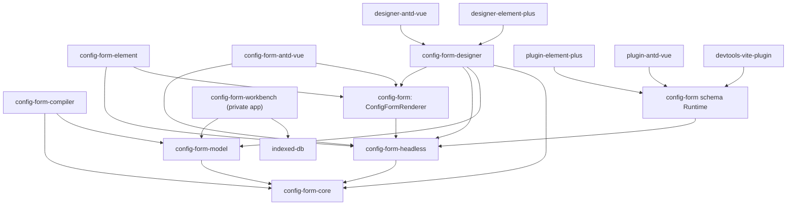

# ConfigForm 架构

本文档是 `packages/ConfigForm` 的架构事实入口，维护包职责、依赖方向、关键协议和扩展边界。子包 README 负责具体 API 与使用示例；当包依赖、公开协议、注册优先级或数据流发生变化时，必须在同一批改动中更新本文档。

## 运行路径

ConfigForm 当前提供两条职责明确的运行路径：

1. **Headless / ConfigFormRenderer 路径**：`@moluoxixi/config-form-headless` 管理字段、校验、状态和 reaction 事务，`@moluoxixi/config-form` 根入口导出的 `ConfigFormRenderer` 负责 Vue DOM，Element Plus、Ant Design Vue 和 Designer 都基于这条路径。
2. **Schema Runtime / Plugin 路径**：`@moluoxixi/config-form` 根入口提供 schema 转换、字段 pipeline 和 runtime plugin 生命周期。这条路径不执行 Headless reaction 协议。

## 依赖方向

下图中的箭头表示“导入或依赖”：



禁止让 Core 依赖 Vue、Zod、Model、Headless、Runtime、Designer 或 UI 组件库。Model 只依赖 Core 的 JSON/reaction/Flow 协议和纯规则协议，不依赖 Vue、Runtime、Designer、Workbench 或 UI 组件库。

## 包职责

| 层               | 包                                                                                               | 主要职责                                                                                                             |
| ---------------- | ------------------------------------------------------------------------------------------------ | -------------------------------------------------------------------------------------------------------------------- |
| 纯协议           | [`@moluoxixi/config-form-core`](./core/)                                                         | JSON 类型、reaction 条件/effect、Flow IR/Execution Plan/Interpreter、稳定 reducer、配置 helper、通用命名模块注册算法 |
| 项目领域模型     | [`@moluoxixi/config-form-model`](./model/)                                                       | ProjectDocument、规范化 PageGraph、Command/Operation/Transaction、COW 历史、Repository 合同与当前 Schema             |
| 语义编译器       | [`@moluoxixi/config-form-compiler`](./compiler/)                                                 | RegistryContractSnapshot、CanonicalProjectIR、稳定语义哈希、Flow Execution Plan 与 Runtime/Source backend 共享输入   |
| 表单内核         | [`@moluoxixi/config-form-headless`](./headless/)                                                 | Vue 字段/节点协议、controller、校验、dirty/touched、readonly、runtime slots、reaction 事务、组件注册特化             |
| Vue 渲染         | [`@moluoxixi/config-form`](./runtime/) 的 `ConfigFormRenderer`                                   | 原生 form、Grid/Flex、字段壳、ARIA、递归节点/slot 和 readonly 渲染；由 Runtime 包根入口导出                          |
| Schema Runtime   | [`@moluoxixi/config-form`](./runtime/)                                                           | schema 转换、组件解析、字段 pipeline、runtime plugin 和 `ConfigForm` 根组件                                          |
| 轻量 UI          | [`config-form-element`](./element/)、[`config-form-antd-vue`](./antd/)                           | 真实 UI 组件、语义组件 key、值事件绑定和样式                                                                         |
| Runtime plugin   | [`plugin-element-plus`](./plugin-element-plus/)、[`plugin-antd-vue`](./plugin-antd-vue/)         | Schema Runtime 的默认字段和 readonly adapter；传给 `runtime.plugins`，不是 Vue `app.use()` 插件                      |
| 可视化设计器     | [`config-form-designer`](./designer/)                                                            | PageGraph 画布、选择/拖拽/overlay、属性面板与 ProjectCommand 桥接；history 属于 ProjectDomainEngine                  |
| Designer adapter | [`designer-element-plus`](./designer-element-plus/)、[`designer-antd-vue`](./designer-antd-vue/) | UI 物料、设计器属性控件、readonly、locale、容器预览和 option resolver 生命周期                                       |
| 开发工具         | [`devtools-vite-plugin`](./devtools-vite-plugin/)                                                | 开发态源码定位和调试信息                                                                                             |
| 集成验证         | [`playground`](./playground/)                                                                    | Element Plus 与 Ant Design Vue 轻量表单的端到端交互验证                                                              |
| 产品工作台       | [`workbench`](./workbench/)                                                                      | 私有在线应用；组合 ProjectEditorSession、Design/Preview、版本化 Repository、模板与只读导出。它不是发布包             |

“轻量 UI 包”“Runtime plugin”“Designer adapter”是三种不同扩展，不应统称为同一种 adapter。

## 关键数据流

### Headless / ConfigFormRenderer

```text
field config
  -> Headless controller / validation / reaction transaction
  -> effective values, state and props
  -> ConfigFormRenderer
  -> registered real Vue component
```

字段显式 `props` 和绑定优先于组件注册项默认值。Element Plus 与 Ant Design Vue 包先提供默认语义组件，再由调用方 `components` 覆盖同名项。

### Designer

```text
Component Registry
  -> ProjectSnapshot / ProjectPage { PageGraph, flows }
  -> ProjectCommand -> OperationBatch -> AppliedTransaction
  -> CompileCoordinator -> PageCompilation
       -> CanonicalPageIR -> Vue Runtime Backend -> Design canvas
       -> iframe RuntimeHost -> adapter resolver -> Preview Runtime
  -> lazy ProjectCompilation
       -> CanonicalProjectIR -> Source Backend -> standalone Vue Source
  -> ProjectDocument -> readonly Config / JSON / Tree
```

Workbench 的规范业务状态是 Model 包的 `ProjectDocument -> ProjectSnapshot -> PageGraph`，画布 selection、诊断、option loading 和 reaction projection 都是派生状态。Drag candidate 使用显式 `ProjectDraftSnapshot`，拥有 draftHash 但不拥有正式 editVersion、Repository revision 或 history。Model 和 Workbench 只接受当前 schema，不在运行时识别、投影或自动转换过期 artifact。

Design Canvas 和右侧 Preview 使用同一份 `PageCompilation` 和同一 Vue Runtime Backend 递归渲染真实注册组件，并分别运行在独立的同源 iframe RuntimeHost。每个 Host 自己加载 adapter resolver、组件库 CSS、Vue Runtime plan 和 Teleport；IDE 只在父 document 渲染 selection、drop、resize 等 editor overlay。Design Host 通过版本化 geometry/pointer bridge 上报稳定 `nodeId`、派生 path、slot 和矩形，业务 Runtime DOM 不包裹编辑器控件。父子 realm 只通过 RuntimeHost v3 的 `channel + version + hostId + projectId + pageId + revision + sequence` JSON-safe 协议传递 PageCompilation、原子 `{ values, touched, validation }` 运行快照、reaction projection、设计态几何/指针信息和稳定 `{ nodeId, event }`，不传 Vue Component、函数、DOM 或 RuntimePlan。结构 sync 与运行 state sync 分离；Host 在异步加载 adapter 期间保留最高 sequence 的运行快照，挂载后只恢复最新状态，相同快照不重复写入 Renderer，避免过期 sync 覆盖输入或使进行中的校验失效。拖拽期间 candidate 先应用到临时 Project draft；Canvas candidate 和跟随指针的 drag visual 分别由真实 Design RuntimeHost 渲染同一个稳定 candidate node，drop 后只提交一次 Project Command，因此 candidate、drag visual 与落地结果共享同一 Registry 默认值、slot 和布局规则。

`DesignerPalette` 只呈现 Registry icon（未提供时显示文本标识）与本地化 display name，不渲染 Provider Runtime specimen；真实 Runtime 仅用于 Canvas candidate、drag visual、落地节点和 Preview。公共 `showSearch` prop 只控制 Palette 自带搜索框，允许 Workbench 等宿主提供唯一搜索入口，不改变 Registry、drag 或 command 合同。

### Workbench Design-first 工作区

```text
Component Registry
  -> ProjectRepository -> immutable ProjectSnapshot
  -> ProjectCommand -> OperationBatch -> ProjectDomainEngine
  -> ProjectEditorSession + ProjectPersistenceSession
     -> ProjectSaveCoordinator + ProjectRepository
     -> RecoveryDraftStore + ProjectCoordinationChannel
  -> Design canvas (唯一编辑入口)
  -> iframe RuntimeHost -> Runtime Renderer -> right-side Preview
  -> Export menu -> readonly Source / Config preview dialog
```

#### Workbench 创建工作区与模板目录

Workbench `App` 拥有 `designer | create` 顶层视图和显式 `project | page` 创建目标；`WorkbenchShell` 只编辑当前项目，不导入模板目录、模板浏览状态或模板预览服务。首次启动且没有项目时，App 直接进入项目创建；从 Topbar 或 Page Manager 进入时，App 只保留稳定的返回焦点 key，取消后由原入口恢复焦点，成功后回到 Designer。

模板来源实现只读异步 `TemplateCatalogProvider`，只返回 JSON-safe manifest 与 page seed。Catalog service 是 `unknown -> typed` 的唯一解析边界，统一校验 provider/template identity、版本、危险 key、seed schema、稳定排序与 Registry requirements；UI 不解释 Provider 原始数据，也不接收 Vue component、函数、HTML 或脚本。内置 Provider 当前提供 Element Plus 与 Ant Design Vue 的空白/资料表单四个条目，未来来源仍必须遵守同一 data-only 合同。

模板详情从不可变 seed 实例化独立的内存候选项目，经 `createProjectSnapshot`、Compiler 和隔离的 `PreviewRuntimeHostFrame` 渲染。目录筛选、选中、移动 pane、eligibility、preview request、values/touched/validation 与 reaction projection 都是创建工作区瞬态状态，不进入 `ProjectDocument`、活动 `PreviewSession`、history、selection、persistence revision 或 autosave。异步 adapter/preview 结果按当前 template request identity 发布，过期结果直接丢弃。

创建项目在 adapter、Registry、schema 与 Compiler 预检通过后才调用 `ProjectRepository.create`；创建页面只向当前 `ProjectEditorSession` 提交一个 `page.add` Project Command，因此一次 Undo 可完整撤销。两条路径共用纯 identity remap：每次实例化都为 project/page/node/field/reaction/flow/flow-node/flow-edge 生成带来源前缀的新 identity，并按所属 Flow/node 作用域重写引用；模板 seed、实例之间不共享可变对象，opaque action config 不做猜测式字符串替换。

同一创建工作区还提供受限的 Config Model JSON ingress。项目目标只接受 `ProjectDocument version: 4`，页面目标只接受 `PageTransferDocument version: 1`；`.vue`、TypeScript Source、ZIP、HTML、JavaScript、裸 `ProjectPage` 与任意工程结构都不会被猜测或逆向导入。输入固定经过 UTF-8 源大小、JSON 语法、迭代式结构预算与污染 key、精确版本 gate、当前 Zod schema、Registry/adapter exact match、fresh identity、schema 复验和 Compiler preview，原始字符串不会进入 Runtime、Repository 或 Project Command。

Project JSON 只接受当前 `version: 4`，Page transfer 只接受当前 `version: 1` 且内部 PageGraph 必须为 `version: 2`；版本缺失、版本不匹配、裸 Page 和未知结构全部 fail closed。安全预算为 2 MiB 源文本、64 层深度、单数组 4096 项、总结构 100000 项、128 页面和 4096 节点，并拒绝任意深度的 `__proto__`、`prototype`、`constructor`。Project Registry lock 必须与当前 Registry 完整精确匹配；Page transfer 携带实际使用组件的 Registry subset lock，并同时精确匹配当前项目 lock 与可用 Registry。

导入成功只创建新实例：project/page/node/field/reaction/Flow/Flow node/Flow edge identity 全部重建，资源 id 与 opaque metadata 在新项目 namespace 内原样保留。项目继续使用 Repository create→prepare/open→失败 delete compensation；页面先绑定分析时的 project id/content hash 做 stale gate，再完整 compile candidate 并提交一个 `page.add` Command。分析、诊断和隔离预览都是创建工作区瞬态状态。

Workbench 的 Source 与 Config 不是编辑 provider，也不参与模型反向解析。导出配置使用公开 `defineFields<T>()` / `defineField({...})` API；Source 使用文件树与只读 Monaco 展示不依赖 ConfigForm runtime 的 standalone Vue 工程，并保留 required、RuleSet/Zod/custom validator、`validateOn` 以及 desktop/tablet/mobile 响应式布局语义。JSON / Tree 可在同一个 pinned ExportSnapshot 内切换“整个项目 / 当前页面”，复制、树视图与下载读取同一不可变值，从而形成 Project/Page JSON 对称 round-trip；导出菜单还可下载完整项目 ZIP。

Workbench 以 `ProjectDocument` 作为唯一业务数据；`ProjectSnapshot` 只是其不可变版本 envelope，不得形成第二套结构模型。
ProjectDomainEngine 只管理页面与节点 Command、semantic inverse history 和 change set；
它不依赖 Repository、Vue、当前页或保存状态。ProjectEditorSession 组合领域引擎与
ProjectSaveCoordinator，后者单独拥有 CAS、commit id、saved cursor 和 saving/error 状态。
当前页属于 Workbench/Design navigation session，不进入 ProjectSnapshot 或领域引擎。
页面管理与页面内部编辑共用同一个 reducer/revision。Repository 只接受 `version: 3` 的当前 Manifest，并按 revisioned Page/Resource 实体存储 snapshot、版本索引和幂等 receipt。一个 manifest revision 可以复用较早的未变化 Page/Resource entity revision，但 load/commit/version read 只能发布 checksum 与引用 revision 全部匹配的完整 `PersistedProjectEnvelope`；非当前 Manifest 被明确拒绝且不会重写。
Repository 只发布通过当前 `ProjectDocument` schema 验证的内容；版本不匹配、结构不完整或 Registry lock 不一致都以可诊断错误拒绝，不扫描其他 namespace，不回写来源记录。

`ProjectPersistenceSession` 是 Workbench 唯一 autosave owner。所有 Project Command、Undo/Redo、拖拽、Inspector 和 Flow 修改只推进同一个 Editor Session；Persistence Session 使用 800ms idle / 5s max-wait 合并正式 revision，并用 250ms idle / 1s max-wait 写独立 recovery draft。Autosave 不封闭 Undo merge group；立即保存与命名检查点显式封闭。Recovery draft 复用正式 snapshot/entity codec 和未变化实体引用，但不进入 Preview、Export 或正式版本；只有较新的 edit identity 能覆盖旧草稿，正式保存较早 capture 后先写后切换地重基线草稿。`ProjectDocument` 不保存 revision、版本、草稿或 UI 状态。

同浏览器多标签页通过 versioned `ProjectCoordinationChannel` 发送 revision 与 presence hint，不传项目内容。clean session 收到更新后从 Repository 重载；dirty session 停止 autosave、固定 durable draft，并让用户查看最新、放弃本地或将草稿另存为新项目。BroadcastChannel 缺失、消息重复或乱序不会改变正确性，Repository CAS 始终是最终边界。版本恢复读取并验证历史 snapshot 后，以当前 revision 为 CAS 基线创建新的 `restore` revision，不覆盖既有历史。

Workbench 的运行与界面状态不进入领域 Controller：`WorkbenchDesignSession` 独立持有活动页/候选页编译、Runtime artifact cache、selection、Project Command 与 Undo/Redo；正式编译失败会清理不可用 Runtime 并把首个诊断交给 UI，不能静默留下空白画布。`PreviewSession` 独立持有 values、touched、validation、Flow projection、最多 200 条 trace 和 Abort 生命周期，并按稳定 field node/component/contractVersion/fingerprint 协调同页 revision 状态；切页、切项目、切 adapter 或字段合同变化时只清理失效状态。`WorkbenchExportService` 只在显式 capture 时懒组装完整 ProjectCompilation，普通 sync 只失效固定 identity。`WorkbenchUiStore` 只持有面板、弹窗、Preview viewport、移动端导航、主题、语言、消息和 lazy-open 状态，不依赖 `ProjectDocument`、Runtime state 或 `ExportSnapshot`。`WorkbenchShell` 分别消费 Design、Preview、Export、UI context，只组合页面和 dialog。

#### Workbench chrome 与 Runtime UI 边界

Workbench chrome 统一使用 Element Plus 提供 Button、Tooltip、Dropdown、Tabs、Input、Scrollbar、Empty、Dialog、Drawer 与 Alert 等通用交互。模板组件通过 `unplugin-vue-components` 的 `ElementPlusResolver({ importStyle: 'css' })` 按需导入；禁止 `app.use(ElementPlus)`、全量默认导入和 `element-plus/dist/index.css`。Workbench 的薄组件只连接 i18n、Project Command、Design/Preview/Export/UI session 和稳定测试标识，不复制组件库的焦点、键盘、菜单或 modal 状态机。

父文档 icon command 通过一个 Element Plus virtual Tooltip host 统一提示；宿主在 `.workbench-app` 与 `#workbench-overlays` 上做事件委托，从 trigger 的 ARIA/command metadata 读取当前 locale、真实 shortcut 和 disabled reason。Designer 只输出 UI 库无关元数据与原生 `title` 提示，不依赖 Element Plus。

父文档弹层统一挂载到 `#workbench-overlays`。该 root 镜像 Workbench Light/Dark token、z-index 和 Topbar 下方的布局边界；Preview Drawer 与 stage 不在 iframe 几何采样期间移动坐标系。Design/Preview Runtime 仍分别在同源 iframe 内加载 Element 或 Ant adapter、Provider CSS 与自己的 Teleport target，Workbench 的 Element Plus 样式和父文档 popper 不进入 Runtime realm。

Canvas camera、selection、resize、drag candidate/visual、Registry specimen、schema-driven Inspector setter、Flow 画布、RuntimeHost bridge 和 Monaco model 继续由领域组件拥有。它们可以在外壳使用成熟组件，但不得为组件化引入第二份 Model、History、Selection、Flow 或 Runtime 状态，也不得建立 `BaseButton`、`BaseTabs` 等二次通用 UI 框架。

打开 Source 导出弹窗时，Workbench 才按需组装当前不可拆分 `ProjectCompilation` 和 generator version
创建一次不可变 `ExportSnapshot`。层级文件树、只读 Monaco、单文件下载和项目 ZIP 全部读取该快照；
后续 Design 修改只会把弹窗标记为 stale，用户显式刷新后才生成新快照。多页面 Source
工程包含 Vue Router、每个页面的独立目录和 `package.json`，且不依赖 ConfigForm
Runtime。Config 导出提供包含每个页面 `defineField` 文件的项目级只读 Source，以及 JSON 和 Tree
投影。快照身份同时比较 compilation key、committed/draft origin 和 generator version；二进制文件
通过防御性字节副本供单文件与 ZIP 下载，调用方不能改写已固定的历史输出。Config Source 在
`extensions['mx.config-form-designer'].placement` 中保留完整父子关系 placement，同时导出 graph
version/props、Project version、Registry lock 和 Flow 编辑坐标；numeric `span` 是当前 PageGraph
placement 到 Runtime 的投影字段，不取代关系元数据。生成端与 Model schema 共用危险对象键守卫。

### ProjectDocument 与 Canonical IR 边界

`@moluoxixi/config-form-model` 定义不依赖 Vue 的项目级生产合同：ProjectDocument 保存页面顺序、路由、首页、registry lock、设置和资源引用；ProjectPage 同时拥有视觉 `PageGraph` 与页面级 `flows`，二者随同一个 Page entity 原子持久化。PageGraph 只使用 `root: SlotItem[] + nodesById` 表达视觉结构，节点关系只存在于 layout `slots`，默认子节点统一使用 `slots.default`，placement 属于 SlotItem 表达的父子关系。field/layout 是判别联合，field 节点不能持有 slots。

`@moluoxixi/config-form-compiler` 只依赖 Core/Model 的 JSON-safe 合同。实时 Design/Preview 链路由 `CompileCoordinator` 接收正式 `ProjectSnapshot` 或带基线 identity/draftHash 的瞬态 `ProjectDraftSnapshot`，按 `ProjectChangeSet.pageIds + nodeChanges` 做页面/子树失效并输出不可拆分的 `PageCompilation { snapshotIdentity, registryUsage, key, page }`。页面 key 只包含页面运行语义、实际使用的 Registry contracts、compiler version 和 structural environment；其他页面、Flow 编辑器坐标、未使用物料和 editVersion 不污染该 key。节点顺序只由 `rootIds/slots` 表达，节点 placement 只保留 parent/slot/语义属性，祖先 path 在遍历时派生；subtree hash 使叶节点变化只重建该节点及其语义祖先。Vue Runtime Backend 直接消费 PageCompilation，并按 resolver + 不可变 Canonical node identity 复用真实 Runtime fragment。只有 Source/Config Export 在用户显式打开或刷新导出快照时，才从同一固定 ProjectSnapshot 组装 `ProjectCompilation { snapshot, registry, key, ir }` 与版本化 `CanonicalProjectIR`。两个编译产物共享 Registry defaults、component version/fingerprint、slot order、parent placement 和 Flow execution plan 规则，禁止 backend 回头解释 ProjectDocument 或调用方自行配对不同 revision 的 Snapshot、Registry 和 IR。

Repository boundary 负责把 `unknown` 严格解析为当前规范的 `ProjectDocument`。UI 与插件提交 JSON-safe `ProjectCommand`；Command Engine 基于当前快照解析语义 action，生成显式 `ProjectOperation[]`；Transaction Engine 才应用规范 OperationBatch。普通节点属性删除使用 `node.patch.unset`，禁止借助序列化时会丢失的 `undefined`。Registry 已陈旧的 `events.<key>`、`bindings.<key>`、`conditions.<key>`、`validation`、`validateOn` 由受限的 `node.config.remove` 单调修复 operation 精确删除：transaction 不能混入普通 operation 或 `mergeKey`，前向仍验证 schema 与 Registry lock，但允许无关陈旧 Registry key 保留；只有 History 可在撤销一个已接受的纯删除时应用领域生成的保真 inverse，UI 没有验证绕过入口。Command resolver 允许中间草稿暂态违反跨实体引用，但完整 batch 发布前必须通过最终 Graph/Registry/Flow 校验。`applyProjectTransaction` 使用结构共享的 copy-on-write 草稿，成功后由 History 推进一次 `editVersion`；Repository 只以独立 `expectedRepositoryRevision` 做 CAS。`applyProjectDraftTransaction` 不推进 editVersion、repositoryRevision、timestamp 或 history，candidate 必须再封装为 `ProjectDraftSnapshot`。调用方不得原地修改已发布快照。

Repository 只读写当前 `ProjectDocument` 与当前 Manifest，不转换其他格式，也不扫描其他 namespace。生成 Source 文件只属于 ExportSnapshot。Workbench Controller 只组合 `ProjectRepository + ProjectEditorSession + ProjectPersistenceSession + ProjectDomainEngine`，禁止增加并行的编辑状态 reducer 或从 Designer 导入持久化模型的代码。

响应式工作区的导航所有权也保持单一：Designer 自带导航时可根据容器焦点切换窄屏
tabpanel；Workbench 传入 `workspace-navigation="external"` 后，移动端底部导航成为窄屏
可见面板的唯一控制者，中屏抽屉状态不得覆盖它。由临时菜单打开 Flow、Page Manager
或 Export 弹窗时，菜单会先把焦点交回稳定触发器，弹窗关闭后再恢复到该触发器。

页面事件流程由当前 `ProjectPage.flows` 唯一持有，视觉 `PageGraph` 不保存流程。Core 只保存 JSON-safe 的
`page.mount | form.submit | component.event -> condition/reaction/action -> terminal` DAG，并先编译为确定性的
`ConfigFormFlowExecutionPlan`，Workbench 再注入显式的 `ConfigFormFlowActionRegistry`。
默认工作台只提供无网络副作用的 `notify` action；业务应用应在宿主边界注册自己的
受控 action。Workbench 的页面级 `PageFlowEngine` 独立拥有 action registry、当前 execution plans、Flow projection、调度器、trace/error 边界和跨 page/revision stale generation；`PreviewSession` 先接收真实 Runtime 的最新 values，再把 `component.event`、`form.submit` 和 `page.mount` 转为稳定 trigger，通过同一 values 端口应用 Flow-owned patch。Flow 的运行值、输出、trace、AbortController 和并发状态都是 Preview
瞬态状态，不写回页面结构。ConfigForm Flow 的 trigger、字段引用、排序和 ID 唯一性都以所属页面为边界；切页会清空 projection 并使旧异步结果失效，同页删除 Flow 会裁剪其 projection。未来跨页自动化使用独立 Project Workflow，而不是把同一 Flow 再存到 ProjectDocument root。Source 导出会把流程逻辑展开到 `src/flows.ts`，仍不依赖
ConfigForm DSL。Core interpreter 与生成的 `flows.ts` 共同固定 `CONFIG_FORM_FLOW_RUNTIME_VERSION`，并通过实际加载执行的并发、timeout、failure edge、model order 与 value patch 矩阵证明等价，而不是只比较模板字符串。Semantic Compiler 同时拒绝 Flow reaction 与同步 binding/reaction 对同一 value/state/prop/validate 能力的重复写入；纯同步联动应回归声明式 reaction，包含 condition/action 的分支与副作用 Flow 保持可用。

`component.event` 触发器只保存页面节点的稳定 `nodeId` 与 Registry 声明的 `event` 名称。Designer 物料通过 `events` 显式声明可编排的非 binding 事件，field 的值事件由同一份 Runtime `valueProp/trigger` 自动生成并按事件名去重。Workbench 的事件编辑入口只有一个：Inspector 列出当前节点的注册事件，点击后用精确 `{ nodeId, event }` 打开 Flow 弹窗；已有同目标流程时直接选中，否则从该事件源创建。Semantic Compiler 把当前页面 Flow 实际引用的 `nodeId + event` 投影为 Canonical node `flowEvents`；Vue backend、`ConfigFormRenderer` 和 standalone Source 只消费该投影，不扫描 DOM，也不会给未引用的 Registry 事件安装 listener。`ConfigFormRenderer` 在 Preview 中从真实 Vue 节点发出事件上下文，Design 模式仍由编辑器桥接拦截；binding listener 先更新 values，再以 Registry 原名分发 Flow，且同一 Vue handler key 只执行一次。简单的 `v-model`、显隐、disabled 和同步 reaction 不应被流程化，只有异步、分支、校验、请求和副作用才进入 Flow。

设计器专属 `id`、`material`、conditions 和 validation 放在 `extensions['mx.config-form-designer']`。业务扩展仍与该命名空间并列保存在 `extensions`，因此 Config、Designer 和 Source 往返时不会把业务元数据藏入设计器私有对象。

## 物料注册器分层

Workbench Registry facade 从每个 Designer 物料模块组合四类能力：JSON-safe `ComponentContract`、Vue `RuntimeBinding`、编辑器 `DesignMetadata` 和生成器 `SourceBinding`。只有 `ComponentContract` 进入 Model 的不可变 `RegistryContractSnapshot` 与项目 `registryLock`；Vue Component、图标、render 函数和 source resolver 留在对应 adapter resolver。合同按 `contractVersion + fingerprint` 对实际使用组件做 exact match；`visualEquivalence` 是 Design 能力声明，必须由真实 Runtime specimen、candidate、落地节点与 Preview 的 geometry/computed-style 浏览器测试证明。

声明 helper 不执行注册，其中字段物料 helper 会消除普通字段的重复节点工厂：

| API                                 | 所属层   | 声明内容                                     |
| ----------------------------------- | -------- | -------------------------------------------- |
| `defineConfigFormModule`            | Core     | 通用 `{ name, order?, value }` 命名模块      |
| `defineConfigFormComponentMaterial` | Headless | Vue 组件或 `ConfigFormComponentRegistration` |
| `defineDesignerMaterialModule`      | Designer | `DesignerMaterialDefinition` 与对应 locale   |
| `defineDesignerFieldMaterial`       | Designer | 单字段组件、默认值与声明式属性               |

真正执行注册的是对应的 `create*Registry`：

```ts
createConfigFormModuleRegistry(modules)
createConfigFormComponentMaterialRegistry(modules)
createDesignerMaterialModuleRegistry(modules)
```

领域 wrapper 保留在 Headless 或 Designer，是为了让 Core 不依赖 Vue 和设计器类型，并允许领域层增加自己的校验。运行时组件物料从 Headless 引入，设计器物料从 Designer 引入。

普通业务字段使用 `defineDesignerFieldMaterial()`，不手写 `kind`、`version` 或 `createNode`。`props` 中的每一项同时声明 Inspector 控件与可选默认值，运行时组件绑定仍可按 Provider 覆盖：

```ts
const inputMaterial = defineDesignerFieldMaterial({
  key: 'project.input',
  title: 'Input',
  category: 'Fields',
  component: ElInput,
  defaultProps: { autocomplete: 'off' },
  value: { kind: 'text' },
  props: {
    placeholder: { label: 'Placeholder', control: 'text', default: '' },
    clearable: { label: 'Clearable', control: 'boolean', default: true },
    maxlength: { label: 'Max length', control: 'number', min: 0, step: 1 },
  },
})

const registry = createElementPlusDesignerRegistry({
  materials: [inputMaterial],
})
```

`defaultProps` 保存不在 Inspector 暴露的静态默认值；`props` 中的 `default` 同时声明可编辑属性的初始值。该 helper 只覆盖一个字段节点和 `text/textarea/number/boolean/select` 属性。布局、复合子图、专用 option source 或自定义 setter 继续使用底层 `DesignerMaterialDefinition`；高级组件、属性控件和 validator 组合通过 registry 的 `layers` option 传入。

`DesignerPropertyControlRegistry` 除简单属性控件外，还提供可选的 `defaultValue` 适配器槽位。Designer 核心只传递 `modelValue`、`kind`、`options`、`disabled` 并监听 `update:modelValue`；未注册时继续使用核心原生 fallback。Element Plus adapter 注册真实的 `ElInput`、`ElInputNumber`、`ElSwitch`、`ElSelect`、`ElDatePicker` 和 `ElTimePicker`，Workbench 无论预览哪种 Provider 都复用这套 Inspector chrome；Provider 组件及其样式不会倒灌到 UI 库无关的 Designer 核心。

内置物料采用 `src/materials/<name>.ts`：

- 只有四个 UI 适配器聚合入口使用 eager `import.meta.glob`；Core、Headless 和 Designer 注册算法只接收普通模块映射。
- 文件名、声明 `name` 和 Designer material key 的末段必须一致。
- 注册器拒绝危险名称、重复名称、多点文件名和非法顺序，并按 `order -> name -> source` 确定性排序。
- 扫描只生成内置默认层，不是业务运行时扩展机制。

Designer 物料代码位置固定如下：

- `designer-element-plus/src/materials/<name>.ts` 与 `designer-antd-vue/src/materials/<name>.ts`：单个物料声明。
- 两个 Adapter 的 `src/materials/{icons,runtime,source,setters,defaults,bindings}/index.ts`：按职责拆分的跨物料能力；`shared/index.ts` 只做叶子声明的聚合入口。
- 两个 Adapter 的 `src/materials/registry.ts`：仅负责 glob 聚合、排序、locale 和 capability registry。
- 两个 Adapter 的 `src/registries/designer-registry.ts`：组合业务 `materials`、高级 `layers` 与 Provider 默认层。
- `designer/src/registry/services/registry.ts`：Provider 无关的合并与 first-wins 注册算法；校验和子图创建分别位于 `registry/validation` 与 `registry/services/subgraph.ts`。
- `workbench/src/adapters/services/load.ts`：选择 Provider registry，并将同一 capability registry 接入 Contract、Runtime 和 Source export。

### 注册优先级

- Element/Antd 轻量 UI：适配器默认组件在前，调用方 `components` 在后，因此调用方覆盖默认项。
- Designer：`createDesignerRegistry` 使用 first-wins；两个 Designer adapter 按业务 `materials`、高级 `layers`、Provider 默认 layer 的顺序组合，因此调用方仍然优先。
- 同一个扫描批次内的重复项必须报错，不能依赖对象覆盖或文件系统顺序。

## Reaction 边界

- Core 定义可序列化条件、effect、配置 helper 和纯执行器。
- Headless 将 reaction 接入值事务、字段状态、组件 props 和校验目标。
- Designer 负责文档校验、可视化编辑、引用诊断和隔离的预演模型。
- Schema Runtime 路径不执行 Headless reaction；Renderer 路径执行。

Reaction 派生状态不会修改 PageGraph 字段定义或导出 JSON。

## Slot 边界

Headless runtime slots 面向 Vue，允许配置节点、数组、组件和 render function。`defineFields<TValues>()` 的字段/单元 attrs 泛型约束为对象，并默认使用 `ConfigFormAttrs`；未显式提供 attrs 时异构 slot 子节点共享该缺省边界，不会因某个节点省略 attrs 而反向推导成 `undefined`。Design slots 是 PageGraph 中可序列化的 `SlotItem[]`，同时受 material 的 `accepts`、`materials`、`min`、`max` 约束。

需要特定 provider 的结构物料通过 Designer Registry 声明 `allowedParents: [{ material, slot }]`。例如 `element.tab-pane` 只能位于 `element.tabs.default`，`element.collapse-item` 只能位于 `element.collapse.default`。该约束是 Registry 能力，不写入 Config Model；文档分析、Design Runtime 投影、Designer command 和 Model Operation 共用它。非法历史节点会被诊断并从 live projection 中省略，避免在 Vue Runtime 中挂载到缺少 provider 的位置。

空 Flex/Grid 的真实 Runtime 高度可以为 0。设计器只在拖拽进行时用测量后的 overlay hit band 提供可命中区域和虚线提示，不向 slot 注入 trailing sentinel、假节点或永久占位，因此 Preview 与导出仍保持真实 DOM。

二者名字相似但协议不同，不应为了“共用”而抽到 Core。Semantic Compiler 负责把 PageGraph 编译成 Runtime Backend 可消费的 Canonical IR。

## Option source 边界

Designer 维护可序列化的 option source 类型和纯 normalization/cache-key helper。Element Plus 与 Ant Design Vue Designer adapter 各自负责 provider、字典、Vue injection、请求取消、缓存状态和控件渲染。

Core、Headless 和 Designer 核心不主动发起网络请求。异步 option provider 当前也不是 Runtime reaction effect。

## 扩展选择

| 需求                                    | 扩展入口                                                |
| --------------------------------------- | ------------------------------------------------------- |
| 为轻量表单注册业务组件                  | `components` prop / `ConfigFormComponentRegistry`       |
| 修改 Schema Runtime 字段转换或 readonly | `FormRuntimePlugin`                                     |
| 添加业务设计器物料或覆盖内置物料        | `defineDesignerFieldMaterial` + adapter `materials`     |
| 注入自定义控件、属性控件或 validator    | adapter registry 的高级 `layers` option                 |
| 添加内置 UI 物料                        | 对应适配器的 `src/materials/<name>.ts`                  |
| 提供远程或字典选项                      | 对应 Designer adapter 的 option resolver context/plugin |
| 添加非渲染业务元数据                    | 节点 `extensions`，使用业务命名空间                     |

## 架构文档维护规则

以下变更必须在同一批代码中更新本文档：

- 新增、删除或重命名 ConfigForm 包或公开子路径；
- 改变包依赖方向、peer dependency 或 UI 框架边界；
- 改变 ProjectDocument、PageGraph、Headless node、reaction、slot 或 option source 协议；
- 改变组件/物料注册方式、命名规则、错误合同或覆盖优先级；
- 改变 Schema Runtime 与 Renderer 路径的职责；
- 新增跨两个以上 ConfigForm 包复用的公共能力。

子包 README 继续维护具体 API。任务设计文档可以记录过程和取舍，但不能替代本文档中的当前架构事实。

## 验证入口

```bash
# ConfigForm 公开包构建、自引用导入和声明消费者
pnpm test:config-form-packages

# 受影响包测试和类型检查
pnpm --filter <package-name> test
pnpm --filter <package-name> typecheck

# Playground 构建
pnpm --filter @config-form/playground build
```
